# Earthquake Claim Accelerator MVP - Implementation Roadmap

## Executive Summary

This implementation roadmap outlines a comprehensive 12-week MVP development strategy for the Earthquake Claim Accelerator, leveraging SPARC methodology and swarm-based parallel execution. The roadmap is designed to deliver a production-ready insurance claim processing system with advanced AI capabilities and real-time coordination.

**Key Metrics:**
- Timeline: 12 weeks (6 sprints)
- Team Size: 12-15 specialized agents across 4 phases
- Target Delivery: Fully functional MVP with core AI features
- Success Rate Target: >90% claim accuracy, <24h processing time

---

## 1. Project Timeline Overview

### 12-Week MVP Schedule

```
Phase 1: Foundation        | Weeks 1-3  | Sprints 1-2
Phase 2: Core Features     | Weeks 4-7  | Sprints 3-4  
Phase 3: AI Integration    | Weeks 8-10 | Sprint 5
Phase 4: Testing & Refine  | Weeks 11-12| Sprint 6
```

### Sprint Structure (2-week iterations)

**Sprint Cadence:**
- Sprint Planning: Monday Week 1 (4h)
- Daily Swarm Sync: 15min daily coordination
- Sprint Review: Friday Week 2 (2h)
- Sprint Retrospective: Friday Week 2 (1h)
- Sprint Buffer: 20% time allocation for blockers

---

## 2. Sprint Planning Framework

### Sprint 1 (Weeks 1-2): Foundation Setup
**Sprint Goal:** Establish technical foundation and project infrastructure

**Key User Stories:**
- As a developer, I need a robust development environment
- As a PM, I need clear project tracking and metrics
- As an architect, I need system design documentation

### Sprint 2 (Week 3): Architecture Finalization
**Sprint Goal:** Complete system architecture and API specifications

### Sprint 3 (Weeks 4-5): Core Backend Development
**Sprint Goal:** Implement claim submission and basic processing

### Sprint 4 (Weeks 6-7): Frontend & Integration
**Sprint Goal:** Build user interface and integrate backend services

### Sprint 5 (Weeks 8-10): AI & Advanced Features
**Sprint Goal:** Deploy AI models and implement intelligent processing

### Sprint 6 (Weeks 11-12): Testing & Production Ready
**Sprint Goal:** Comprehensive testing, optimization, and deployment

---

## 3. Phase Breakdown

## Phase 1: Foundation (Weeks 1-3)

### Objectives
- Establish technical infrastructure
- Set up development workflows
- Define system architecture
- Create project governance

### Key Deliverables

#### Week 1: Infrastructure Setup
- **Development Environment**
  - Docker containerization setup
  - CI/CD pipeline implementation
  - Code quality tools (ESLint, Prettier, SonarQube)
  - Git workflow and branching strategy

- **Project Management**
  - Agile board setup (Jira/GitHub Projects)
  - Documentation structure
  - Communication channels
  - Metrics dashboard

#### Week 2: Technology Stack
- **Backend Architecture**
  - Node.js/Express.js API framework
  - PostgreSQL database setup
  - Redis caching layer
  - Message queue (RabbitMQ/Apache Kafka)

- **Frontend Foundation**
  - React.js application structure
  - State management (Redux/Zustand)
  - UI component library selection
  - Responsive design framework

#### Week 3: System Architecture
- **Database Design**
  - Entity-relationship modeling
  - Data migration scripts
  - Backup and recovery procedures
  - Performance indexing strategy

- **API Specification**
  - OpenAPI/Swagger documentation
  - Authentication & authorization design
  - Rate limiting strategy
  - Error handling standards

### Swarm Agent Allocation (Phase 1)

| Agent Type | Count | Primary Focus |
|------------|-------|---------------|
| **System Architect** | 1 | Overall system design, technology decisions |
| **DevOps Engineer** | 1 | Infrastructure, CI/CD, deployment |
| **Backend Developer** | 2 | API development, database design |
| **Frontend Developer** | 1 | UI framework setup, component library |
| **Database Architect** | 1 | Schema design, optimization |
| **Security Specialist** | 1 | Security architecture, compliance |

### Success Criteria
- ✅ All development environments functional
- ✅ CI/CD pipeline processing commits
- ✅ Database schema validated
- ✅ API endpoints returning mock data
- ✅ Basic UI components rendering

---

## Phase 2: Core Features (Weeks 4-7)

### Objectives
- Implement core claim processing functionality
- Build user management system
- Develop document handling capabilities
- Create basic reporting dashboard

### Key Deliverables

#### Weeks 4-5: Backend Core Features
- **User Management**
  - Authentication system (JWT-based)
  - Role-based access control (RBAC)
  - User profile management
  - Password recovery workflow

- **Claim Management**
  - Claim submission API
  - Claim status tracking
  - Basic validation rules
  - Notification system

- **Document Processing**
  - File upload handling (images, PDFs)
  - Cloud storage integration (AWS S3/Google Cloud)
  - Document metadata extraction
  - Version control system

#### Weeks 6-7: Frontend Development
- **User Interface**
  - Claim submission forms
  - Dashboard for claim tracking
  - Document upload interface
  - Responsive mobile design

- **Integration Layer**
  - API client implementation
  - Error handling and retry logic
  - Loading states and user feedback
  - Offline capability foundation

### Swarm Agent Allocation (Phase 2)

| Agent Type | Count | Primary Focus |
|------------|-------|---------------|
| **Backend Developer** | 3 | API endpoints, business logic |
| **Frontend Developer** | 2 | UI components, user experience |
| **Full-Stack Developer** | 1 | Integration, API client |
| **QA Engineer** | 1 | Testing framework, test cases |
| **UX Designer** | 1 | User experience, interface design |
| **Integration Specialist** | 1 | Third-party service integration |

### Success Criteria
- ✅ Users can register and authenticate
- ✅ Claims can be submitted with documents
- ✅ Basic claim status tracking works
- ✅ Dashboard displays claim information
- ✅ Document upload and storage functional

---

## Phase 3: AI Integration (Weeks 8-10)

### Objectives
- Deploy machine learning models for damage assessment
- Implement intelligent document analysis
- Create automated decision-making workflows
- Integrate real-time processing capabilities

### Key Deliverables

#### Week 8: AI Foundation
- **ML Model Deployment**
  - Image analysis for damage assessment
  - Document classification models
  - Natural language processing for descriptions
  - Model serving infrastructure (TensorFlow Serving/MLflow)

- **AI Service Layer**
  - Microservices architecture for AI components
  - Model version management
  - A/B testing framework
  - Performance monitoring

#### Week 9: Intelligent Processing
- **Automated Assessment**
  - Damage severity scoring
  - Repair cost estimation
  - Fraud detection algorithms
  - Risk assessment modeling

- **Document Intelligence**
  - OCR for text extraction
  - Form field recognition
  - Data validation and correction
  - Automated categorization

#### Week 10: Integration & Optimization
- **Workflow Automation**
  - Decision trees for claim routing
  - Automated approval workflows
  - Exception handling processes
  - Human-in-the-loop interfaces

- **Real-time Processing**
  - Event-driven architecture
  - Streaming data processing
  - Real-time notifications
  - Performance optimization

### Swarm Agent Allocation (Phase 3)

| Agent Type | Count | Primary Focus |
|------------|-------|---------------|
| **ML Engineer** | 2 | Model deployment, optimization |
| **Data Scientist** | 1 | Model training, validation |
| **AI Architect** | 1 | AI system design, integration |
| **Backend Developer** | 2 | AI service integration |
| **Performance Engineer** | 1 | Optimization, monitoring |
| **Data Engineer** | 1 | Data pipelines, preprocessing |

### Success Criteria
- ✅ AI models accurately assess damage (>85% accuracy)
- ✅ Document processing fully automated
- ✅ Decision workflows reduce manual review by 60%
- ✅ Real-time processing under 30 seconds
- ✅ Model performance monitoring active

---

## Phase 4: Testing & Refinement (Weeks 11-12)

### Objectives
- Comprehensive testing across all components
- Performance optimization and scalability testing
- Security auditing and compliance validation
- Production deployment preparation

### Key Deliverables

#### Week 11: Comprehensive Testing
- **Quality Assurance**
  - Unit test coverage >90%
  - Integration testing suite
  - End-to-end testing scenarios
  - Load testing and performance validation

- **Security & Compliance**
  - Security penetration testing
  - GDPR/CCPA compliance audit
  - Insurance industry compliance (SOX, etc.)
  - Data privacy validation

#### Week 12: Production Readiness
- **Performance Optimization**
  - Database query optimization
  - Caching strategy refinement
  - CDN configuration
  - API response time optimization

- **Deployment Preparation**
  - Production environment setup
  - Monitoring and alerting systems
  - Backup and disaster recovery
  - Documentation finalization

### Swarm Agent Allocation (Phase 4)

| Agent Type | Count | Primary Focus |
|------------|-------|---------------|
| **QA Engineer** | 2 | Testing automation, quality validation |
| **Performance Engineer** | 1 | Optimization, scalability testing |
| **Security Specialist** | 1 | Security audit, compliance |
| **DevOps Engineer** | 1 | Production deployment, monitoring |
| **Technical Writer** | 1 | Documentation, user guides |
| **Product Manager** | 1 | Acceptance testing, requirements validation |

### Success Criteria
- ✅ All tests passing with >90% coverage
- ✅ Performance benchmarks met
- ✅ Security audit cleared
- ✅ Production deployment successful
- ✅ User acceptance testing completed

---

## 4. Detailed Swarm Agent Coordination

### Agent Distribution Across Phases

```mermaid
gantt
    title Earthquake Claim Accelerator MVP - Agent Allocation
    dateFormat X
    axisFormat %d
    
    section Phase 1
    System Architect    :1, 21
    DevOps Engineer    :1, 21
    Backend Developer  :1, 14
    Database Architect :7, 21
    Security Specialist:14, 21
    
    section Phase 2
    Backend Developer  :22, 49
    Frontend Developer :22, 49
    QA Engineer       :36, 49
    UX Designer       :22, 35
    
    section Phase 3
    ML Engineer       :50, 70
    Data Scientist    :50, 63
    AI Architect      :50, 70
    Performance Engineer:57, 70
    
    section Phase 4
    QA Engineer       :71, 84
    Security Specialist:71, 77
    Technical Writer  :71, 84
    Product Manager   :78, 84
```



### Specialized Agent Roles

#### **Hierarchical Coordination Structure**

```
🏛️ MVP Coordinator (Strategic Level)
├── 📋 Phase Leaders (Tactical Level)
│   ├── 🔧 Technical Specialists (Operational Level)
│   ├── 🧪 Quality Specialists (Operational Level)
│   └── 📊 Analysis Specialists (Operational Level)
└── 🤝 Integration Specialists (Cross-Phase)
```

#### **Agent Specializations by Phase**

**Phase 1 Agents:**
- **System Architect**: Overall system design, technology stack decisions
- **DevOps Engineer**: Infrastructure, CI/CD pipeline, deployment automation
- **Database Architect**: Schema design, performance optimization
- **Security Specialist**: Security architecture, compliance framework
- **Backend Developer**: Core API development, business logic
- **Frontend Developer**: UI framework setup, component architecture

**Phase 2 Agents:**
- **Full-Stack Developer**: End-to-end feature implementation
- **Integration Specialist**: Third-party service integration
- **UX Designer**: User experience design, interface optimization
- **QA Engineer**: Testing framework, automated test development
- **API Specialist**: RESTful service design, documentation

**Phase 3 Agents:**
- **ML Engineer**: Model deployment, inference optimization
- **Data Scientist**: Model training, validation, performance analysis
- **AI Architect**: AI system design, model integration
- **Data Engineer**: Data pipeline development, preprocessing
- **Performance Engineer**: System optimization, scalability testing

**Phase 4 Agents:**
- **Test Automation Engineer**: Comprehensive testing, CI/CD integration
- **Security Auditor**: Penetration testing, compliance validation
- **Technical Writer**: Documentation, user guides, API docs
- **Product Manager**: Acceptance criteria, stakeholder validation
- **Release Manager**: Production deployment, rollback procedures

---

## 5. Deliverables and Milestones

### Major Milestones

#### M1: Infrastructure Ready (End Week 3)
**Deliverables:**
- ✅ Complete development environment
- ✅ CI/CD pipeline operational
- ✅ Database schema implemented
- ✅ Basic API framework running
- ✅ Frontend application scaffold

**Success Metrics:**
- Build success rate: 100%
- Deployment time: <5 minutes
- Environment setup time: <30 minutes

#### M2: Core Functionality Complete (End Week 7)
**Deliverables:**
- ✅ User authentication system
- ✅ Claim submission workflow
- ✅ Document upload and management
- ✅ Basic dashboard and reporting
- ✅ Mobile-responsive interface

**Success Metrics:**
- API response time: <200ms
- UI load time: <2 seconds
- User workflow completion rate: >95%

#### M3: AI Integration Live (End Week 10)
**Deliverables:**
- ✅ Damage assessment AI models
- ✅ Document analysis automation
- ✅ Automated decision workflows
- ✅ Real-time processing pipeline
- ✅ Model monitoring dashboard

**Success Metrics:**
- AI accuracy: >85%
- Processing time: <30 seconds
- Automation rate: >60% of claims

#### M4: Production Ready (End Week 12)
**Deliverables:**
- ✅ Comprehensive test suite
- ✅ Security audit completion
- ✅ Performance optimization
- ✅ Production deployment
- ✅ User documentation

**Success Metrics:**
- Test coverage: >90%
- Security scan: 0 critical issues
- Performance benchmarks: Met
- User acceptance: >90% satisfaction

### Weekly Deliverable Schedule

| Week | Primary Deliverables | Secondary Deliverables |
|------|---------------------|------------------------|
| **1** | Development environment setup | Project documentation structure |
| **2** | Technology stack implementation | CI/CD pipeline |
| **3** | System architecture finalized | Database schema complete |
| **4** | User authentication system | Basic claim submission |
| **5** | Document management system | Notification framework |
| **6** | Frontend claim interface | Dashboard implementation |
| **7** | Mobile responsiveness | Integration testing |
| **8** | AI model deployment | Document AI processing |
| **9** | Automated assessment workflow | Fraud detection system |
| **10** | Real-time processing pipeline | Performance optimization |
| **11** | Comprehensive testing suite | Security audit |
| **12** | Production deployment | User training materials |

---

## 6. Resource Requirements

### Human Resources

#### Core Development Team
```
👥 Total Team Size: 12-15 specialists
📊 Allocation by Phase:
- Phase 1: 6 agents (Infrastructure focus)
- Phase 2: 6 agents (Feature development)  
- Phase 3: 6 agents (AI integration)
- Phase 4: 6 agents (Quality & deployment)
```

#### Skill Requirements Matrix

| Skill Area | Junior | Mid | Senior | Lead | Total FTE |
|------------|--------|-----|--------|------|-----------|
| **Backend Development** | 1 | 2 | 1 | 1 | 3.5 |
| **Frontend Development** | 1 | 1 | 1 | - | 2.5 |
| **DevOps/Infrastructure** | - | 1 | 1 | - | 2.0 |
| **ML/AI Engineering** | - | 1 | 1 | 1 | 2.5 |
| **QA/Testing** | 1 | 1 | - | - | 1.5 |
| **UX/UI Design** | - | 1 | - | - | 1.0 |
| **Data Engineering** | - | 1 | - | - | 1.0 |
| **Security Specialist** | - | - | 1 | - | 1.0 |
| **Technical Writing** | 1 | - | - | - | 0.5 |
| **Product Management** | - | - | 1 | - | 1.0 |
| ****Total FTE** | **4** | **8** | **6** | **2** | **16.5** |

### Technology Resources

#### Development Tools & Licenses
- **IDE Licenses**: JetBrains, VS Code extensions
- **Design Tools**: Figma, Adobe Creative Suite
- **Testing Tools**: Selenium Grid, BrowserStack
- **Monitoring**: DataDog, New Relic
- **Security**: SonarQube, OWASP ZAP

#### Infrastructure Requirements

##### Development Environment
```yaml
Development:
  - Servers: 3x AWS EC2 instances (t3.large)
  - Database: PostgreSQL RDS (db.t3.medium)
  - Storage: 500GB S3 bucket
  - CDN: CloudFront distribution
  - Monitoring: CloudWatch, custom metrics

Staging:
  - Servers: 2x AWS EC2 instances (t3.xlarge)
  - Database: PostgreSQL RDS (db.r5.large)
  - Storage: 1TB S3 bucket  
  - Load Balancer: Application Load Balancer
  - Caching: ElastiCache Redis cluster

Production (MVP):
  - Servers: 3x AWS EC2 instances (c5.2xlarge)
  - Database: PostgreSQL RDS Multi-AZ (db.r5.xlarge)
  - Storage: 2TB S3 bucket with lifecycle policies
  - CDN: Global CloudFront distribution
  - Caching: ElastiCache Redis cluster
  - Monitoring: Full observability stack
```

##### AI/ML Infrastructure
```yaml
ML Development:
  - GPU Instances: 2x p3.2xlarge (NVIDIA V100)
  - ML Storage: 5TB EFS for model artifacts
  - Model Registry: MLflow on EC2
  - Training Pipeline: SageMaker training jobs

ML Production:
  - Inference: 2x ml.c5.xlarge SageMaker endpoints
  - Model Storage: S3 with versioning
  - Monitoring: SageMaker Model Monitor
  - Auto-scaling: Based on inference volume
```

### Budget Allocation

#### Infrastructure Costs (12 weeks)
```
☁️ Cloud Infrastructure: $8,000
🔧 Development Tools: $2,500
🧪 Testing Services: $1,500
📊 Monitoring/Analytics: $1,200
🛡️ Security Tools: $800
📚 Training/Certification: $1,000

Total Infrastructure: $15,000
```

#### Personnel Costs (Estimated)
```
👥 Development Team (16.5 FTE × 12 weeks): $198,000
🎯 Specialized Consultants: $25,000
📋 Project Management: $15,000

Total Personnel: $238,000
```

---

## 7. Risk Management Plan

### Risk Assessment Matrix

| Risk Category | Risk Description | Probability | Impact | Risk Score | Mitigation Strategy |
|---------------|-----------------|-------------|--------|------------|-------------------|
| **Technical** | AI model accuracy below target | Medium | High | 🔴 High | Parallel model development, expert validation |
| **Technical** | Integration complexity delays | High | Medium | 🟡 Medium | Incremental integration, early testing |
| **Resource** | Key developer unavailable | Medium | High | 🔴 High | Cross-training, documentation, backup resources |
| **Timeline** | Scope creep from stakeholders | High | Medium | 🟡 Medium | Clear requirements, change control process |
| **Technical** | Performance issues at scale | Medium | High | 🔴 High | Early load testing, performance monitoring |
| **External** | Third-party service limitations | Low | Medium | 🟢 Low | Alternative service providers, fallback options |
| **Compliance** | Regulatory requirement changes | Low | High | 🟡 Medium | Regular compliance reviews, flexible architecture |
| **Security** | Data breach or security vulnerability | Low | Critical | 🔴 High | Security-first design, regular audits |

### Risk Mitigation Strategies

#### High-Risk Items (Immediate Action Required)

##### 1. AI Model Accuracy Risk
**Mitigation Plan:**
- Develop multiple model approaches in parallel
- Implement ensemble methods for improved accuracy
- Establish human validation feedback loops
- Create model performance monitoring dashboards
- Plan for gradual AI rollout with manual fallback

**Timeline:** Weeks 6-10
**Resources:** 2 Data Scientists, 1 ML Engineer
**Budget:** $15,000 for additional compute resources

##### 2. Key Developer Availability Risk  
**Mitigation Plan:**
- Cross-train team members on critical components
- Maintain comprehensive technical documentation
- Establish contractor relationships for emergency coverage
- Implement pair programming for knowledge sharing
- Create detailed handoff procedures

**Timeline:** Ongoing
**Resources:** All team members
**Budget:** $5,000 for documentation tools

##### 3. Security Vulnerability Risk
**Mitigation Plan:**
- Security-by-design architecture principles
- Regular security code reviews
- Automated vulnerability scanning
- Third-party security audit in Week 11
- Incident response plan development

**Timeline:** Weeks 1-12
**Resources:** 1 Security Specialist
**Budget:** $8,000 for security tools and audit

#### Medium-Risk Items (Monitor and Prepare)

##### 1. Integration Complexity
**Monitoring Indicators:**
- API integration test failure rates
- Cross-service communication latency
- Error rates in service interactions

**Contingency Plans:**
- Simplified integration approach
- Additional integration testing time
- Fallback to manual processes if needed

##### 2. Timeline Pressure from Scope Creep
**Prevention Measures:**
- Strict change control board
- Regular stakeholder alignment meetings
- Clear MVP scope documentation
- Feature backlog for post-MVP release

### Contingency Planning

#### Critical Path Protection
```
🛡️ Critical Path Items:
1. Database schema design (Week 3)
2. Core API development (Week 5)
3. AI model integration (Week 9)
4. Security audit completion (Week 11)

💼 Contingency Measures:
- 20% time buffer in each phase
- Parallel development streams
- Early risk identification protocols
- Rapid escalation procedures
```

#### Fallback Scenarios

##### Scenario 1: AI Models Underperform
**Fallback Plan:**
- Revert to rule-based processing
- Implement manual review workflows
- Plan AI improvements for v1.1 release

##### Scenario 2: Major Technical Blocker
**Fallback Plan:**
- Reduce MVP scope to core features
- Extend timeline by 2 weeks maximum
- Bring in specialized consultants

##### Scenario 3: Resource Unavailability
**Fallback Plan:**
- Redistribute work among team members
- Engage pre-approved contractor network
- Prioritize critical features only

---

## 8. Success Metrics and KPIs

### Primary Success Metrics

#### Business Impact KPIs
```
📊 Claim Processing Efficiency:
- Target: 70% reduction in processing time
- Baseline: 5-7 days manual processing
- MVP Goal: 1-2 days automated processing

🎯 Accuracy Improvements:
- Target: >90% AI assessment accuracy
- Baseline: 85% manual accuracy with inconsistency
- MVP Goal: Consistent 90%+ accuracy with audit trail

💰 Cost Reduction:
- Target: 40% reduction in processing costs
- Baseline: $150 per claim processing cost
- MVP Goal: <$90 per claim processing cost

👥 User Satisfaction:
- Target: >85% user satisfaction score
- Measurement: Post-interaction surveys
- Key Factors: Ease of use, processing speed, accuracy
```

#### Technical Performance KPIs

##### System Performance
| Metric | Target | Measurement Method | Review Frequency |
|--------|--------|-------------------|------------------|
| **API Response Time** | <200ms average | Application monitoring | Real-time |
| **System Uptime** | >99.5% | Infrastructure monitoring | Daily |
| **Database Query Time** | <50ms average | Database monitoring | Daily |
| **Page Load Time** | <2 seconds | Frontend monitoring | Daily |
| **Mobile Performance** | <3 seconds | Mobile testing | Weekly |

##### AI/ML Performance  
| Metric | Target | Measurement Method | Review Frequency |
|--------|--------|-------------------|------------------|
| **Model Accuracy** | >85% | Validation dataset | Weekly |
| **False Positive Rate** | <10% | Confusion matrix analysis | Weekly |
| **Processing Time** | <30 seconds | End-to-end timing | Real-time |
| **Model Drift** | <5% monthly | Statistical monitoring | Monthly |
| **Data Quality Score** | >95% | Data validation rules | Daily |

### Development Process KPIs

#### Agile Metrics
```
🏃‍♂️ Sprint Metrics:
- Sprint Goal Achievement: >90%
- Story Point Velocity: Track and stabilize
- Sprint Burndown: Predictable completion
- Definition of Done: 100% compliance

🔧 Quality Metrics:
- Code Coverage: >90%
- Bug Density: <0.5 per 1000 lines
- Security Vulnerabilities: 0 critical, <5 high
- Technical Debt Ratio: <20%

⚡ Delivery Metrics:
- Deployment Success Rate: >95%
- Mean Time to Recovery: <1 hour
- Change Failure Rate: <10%
- Lead Time: <2 days feature to production
```

### Success Criteria by Phase

#### Phase 1 Success Criteria
- ✅ **Infrastructure Readiness**: 100% environment availability
- ✅ **Team Productivity**: All developers productive within 48 hours
- ✅ **Architecture Approval**: Stakeholder sign-off on system design
- ✅ **Pipeline Functionality**: Automated build/test/deploy working

#### Phase 2 Success Criteria
- ✅ **Feature Completeness**: All core features implemented and tested
- ✅ **User Experience**: Positive usability testing feedback
- ✅ **Integration Success**: All services communicating properly
- ✅ **Performance Baseline**: Basic performance targets met

#### Phase 3 Success Criteria
- ✅ **AI Accuracy**: Models meeting accuracy targets
- ✅ **Automation Rate**: 60% of claims processed automatically
- ✅ **Real-time Processing**: End-to-end processing under 30 seconds
- ✅ **Scalability**: System handling target load

#### Phase 4 Success Criteria
- ✅ **Quality Gates**: All testing criteria passed
- ✅ **Security Clearance**: Security audit completed successfully
- ✅ **Production Readiness**: System deployed and stable
- ✅ **User Acceptance**: End-user validation completed

### Monitoring and Reporting Framework

#### Real-time Dashboards
```
📊 Executive Dashboard:
- Overall project health (Red/Yellow/Green)
- Key milestone progress
- Budget utilization
- Risk indicator matrix

🔧 Technical Dashboard:
- System performance metrics
- AI model performance
- Code quality indicators
- Deployment pipeline status

👥 Team Dashboard:
- Sprint progress and burndown
- Individual and team velocity
- Blocked items and impediments
- Code review and testing metrics
```

#### Reporting Schedule
- **Daily**: Stand-up metrics, system health
- **Weekly**: Sprint progress, KPI review
- **Bi-weekly**: Milestone assessment, risk review
- **Monthly**: Stakeholder reporting, budget review

---

## Conclusion

This implementation roadmap provides a comprehensive framework for delivering the Earthquake Claim Accelerator MVP within 12 weeks using SPARC methodology and swarm-based parallel execution. The plan emphasizes:

🎯 **Strategic Focus**: Clear phase objectives with measurable outcomes
⚡ **Parallel Execution**: Swarm coordination for maximum efficiency  
🛡️ **Risk Management**: Proactive identification and mitigation
📊 **Data-Driven**: Continuous monitoring and optimization
🤝 **Stakeholder Alignment**: Regular validation and feedback loops

**Next Steps:**
1. Stakeholder review and approval of roadmap
2. Resource allocation and team assembly
3. Detailed sprint planning for Phase 1
4. Infrastructure setup and development environment preparation
5. Initiation of swarm coordination workflows

**Success Indicators:**
- On-time delivery of MVP within 12-week timeline
- Achievement of all technical and business KPIs
- Successful deployment to production environment
- Positive user acceptance and stakeholder satisfaction

This roadmap serves as the foundational document for MVP execution, with regular updates and refinements based on sprint retrospectives and stakeholder feedback.

---

*Document Version: 1.0*  
*Created: 2025-08-27*  
*Last Updated: 2025-08-27*  
*Next Review: Weekly during project execution*