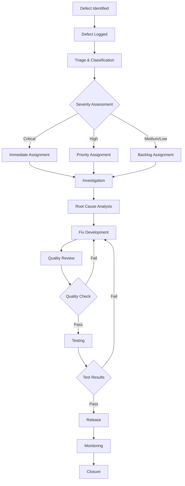

# Quality Assurance Plan - Earthquake Claim Accelerator MVP

## Executive Summary

This comprehensive Quality Assurance plan ensures the Earthquake Claim Accelerator MVP meets the highest standards of quality, security, performance, and compliance. The plan implements multiple review gates with automated quality checks and continuous feedback loops to deliver a robust, secure, and reliable product.

## 1. QA Strategy and Objectives

### 1.1 Quality Vision
To deliver a secure, performant, and compliant earthquake claim processing system that meets all regulatory requirements while providing exceptional user experience.

### 1.2 Quality Objectives

#### Primary Objectives
- **Security**: Achieve 99.9% security compliance score
- **Performance**: Sub-2-second response times for 95% of transactions
- **Reliability**: 99.95% uptime with zero data loss
- **Compliance**: 100% adherence to insurance regulations (NAIC, SOX, GDPR)
- **User Experience**: 90%+ user satisfaction score

#### Quality Principles
1. **Shift-Left Quality**: Integrate quality checks early in development
2. **Automated First**: Prioritize automated testing over manual processes
3. **Continuous Monitoring**: Real-time quality metrics and alerts
4. **Risk-Based Testing**: Focus testing efforts on high-risk areas
5. **Feedback Loops**: Rapid quality feedback to development teams

### 1.3 Quality Scope

#### In Scope
- Functional quality validation
- Non-functional requirements testing
- Security vulnerability assessment
- Performance and scalability testing
- Compliance and regulatory validation
- User experience and accessibility testing
- Data integrity and privacy protection

#### Out of Scope
- Third-party service quality (monitoring only)
- Infrastructure quality (AWS responsibility)
- Legacy system migration validation

## 2. Quality Review Gates

### 2.1 Code Review Process

#### 2.1.1 Automated Code Quality Gates

```yaml
# Pre-commit Hooks
pre_commit_checks:
  - static_analysis: ESLint, SonarQube, CodeClimate
  - security_scan: Snyk, OWASP ZAP, Semgrep
  - unit_tests: Jest coverage >= 90%
  - type_checking: TypeScript strict mode
  - formatting: Prettier, EditorConfig
  - documentation: JSDoc coverage >= 80%

# Pull Request Gates
pr_quality_gates:
  - automated_tests: All tests must pass
  - code_coverage: Minimum 90% line coverage
  - security_scan: Zero high/critical vulnerabilities
  - performance_impact: No degradation > 10%
  - accessibility: WCAG 2.1 AA compliance
  - complexity_analysis: Cyclomatic complexity <= 10
```

#### 2.1.2 Human Code Review Process

**Review Criteria:**
- **Functionality**: Code meets requirements
- **Security**: No security vulnerabilities or bad practices
- **Performance**: Efficient algorithms and resource usage
- **Maintainability**: Clean, readable, and well-documented code
- **Standards**: Adherence to coding standards and patterns

**Review Workflow:**
1. **Author Self-Review**: Mandatory before PR submission
2. **Automated Review**: All automated checks pass
3. **Peer Review**: Two reviewers minimum for critical components
4. **Senior Review**: Lead developer review for architecture changes
5. **Security Review**: Security team review for sensitive components

#### 2.1.3 Code Quality Metrics

```javascript
// Quality Metrics Dashboard
const codeQualityMetrics = {
  coverage: {
    unit: '>=90%',
    integration: '>=80%',
    e2e: '>=70%'
  },
  complexity: {
    cyclomatic: '<=10',
    cognitive: '<=15',
    maintainability: '>=70'
  },
  security: {
    vulnerabilities: 0,
    code_smells: '<=5 per 1000 LOC',
    technical_debt: '<=5%'
  },
  documentation: {
    api_coverage: '>=95%',
    code_comments: '>=80%',
    README_completeness: '100%'
  }
};
```

### 2.2 Design Review Gates

#### 2.2.1 Architecture Review Gate

**Review Criteria:**
- System architecture scalability and resilience
- Security architecture and threat modeling
- Data flow and storage design
- Integration patterns and API design
- Performance and caching strategies

**Automated Checks:**
```yaml
architecture_validation:
  - dependency_analysis: Architecture decision records (ADRs)
  - security_patterns: OWASP security patterns validation
  - performance_patterns: Caching, CDN, load balancing
  - data_governance: PII handling, retention policies
  - disaster_recovery: Backup and recovery procedures
```

#### 2.2.2 UI/UX Review Gate

**Review Criteria:**
- User experience flow validation
- Accessibility compliance (WCAG 2.1 AA)
- Responsive design across devices
- Performance optimization
- Brand consistency

**Automated Checks:**
```yaml
ux_validation:
  - accessibility_scan: axe-core, Lighthouse accessibility
  - performance_audit: Lighthouse performance score >= 90
  - responsive_testing: Cross-browser and device testing
  - visual_regression: Percy, Chromatic visual testing
  - usability_metrics: Task completion rate, error rate
```

### 2.3 Security Review Gates

#### 2.3.1 Security Testing Framework

```yaml
security_testing_layers:
  static_analysis:
    - sast_tools: [Snyk Code, SonarQube Security, Semgrep]
    - dependency_scan: [Snyk Dependencies, OWASP Dependency Check]
    - secret_detection: [GitGuardian, TruffleHog]
    
  dynamic_analysis:
    - dast_tools: [OWASP ZAP, Burp Suite]
    - api_security: [Postman Security Tests, REST Assured]
    - penetration_testing: Quarterly external assessment
    
  infrastructure_security:
    - container_scan: [Twistlock, Aqua Security]
    - cloud_security: [AWS Security Hub, CloudTrail]
    - network_security: [VPC Flow Logs, WAF Rules]
```

#### 2.3.2 Security Compliance Checklist

**OWASP Top 10 Validation:**
- [ ] Injection Prevention (SQL, NoSQL, LDAP, Command)
- [ ] Broken Authentication Protection
- [ ] Sensitive Data Exposure Prevention
- [ ] XML External Entities (XXE) Protection
- [ ] Broken Access Control Prevention
- [ ] Security Misconfiguration Prevention
- [ ] Cross-Site Scripting (XSS) Protection
- [ ] Insecure Deserialization Prevention
- [ ] Known Vulnerabilities Management
- [ ] Insufficient Logging & Monitoring Prevention

**Data Protection Compliance:**
- [ ] GDPR compliance for EU data subjects
- [ ] CCPA compliance for California residents
- [ ] PCI DSS compliance for payment processing
- [ ] HIPAA compliance for health information
- [ ] SOX compliance for financial reporting

### 2.4 Performance Review Gates

#### 2.4.1 Performance Testing Framework

```yaml
performance_testing_strategy:
  load_testing:
    - normal_load: 1000 concurrent users
    - peak_load: 5000 concurrent users
    - stress_test: 150% of peak capacity
    - volume_test: 1M+ claims processing
    
  performance_metrics:
    - response_time: p95 < 2s, p99 < 5s
    - throughput: >= 1000 requests/second
    - resource_utilization: CPU < 70%, Memory < 80%
    - error_rate: < 0.1%
    
  tools:
    - load_testing: [k6, JMeter, Artillery]
    - monitoring: [New Relic, DataDog, CloudWatch]
    - profiling: [Chrome DevTools, Node.js Profiler]
```

#### 2.4.2 Performance Benchmarks

```javascript
// Performance SLA Requirements
const performanceSLA = {
  web_application: {
    page_load_time: {
      target: '< 2 seconds',
      threshold: '< 3 seconds'
    },
    api_response_time: {
      target: '< 500ms',
      threshold: '< 1000ms'
    }
  },
  batch_processing: {
    claim_processing: {
      target: '< 30 seconds per claim',
      threshold: '< 60 seconds per claim'
    },
    report_generation: {
      target: '< 5 minutes',
      threshold: '< 10 minutes'
    }
  },
  database_operations: {
    query_performance: {
      simple_queries: '< 100ms',
      complex_queries: '< 1000ms',
      bulk_operations: '< 5000ms'
    }
  }
};
```

### 2.5 Compliance Review Gates

#### 2.5.1 Regulatory Compliance Framework

```yaml
insurance_compliance:
  naic_compliance:
    - data_standards: NAIC Data Call requirements
    - reporting: Regulatory reporting standards
    - privacy: State privacy regulations
    
  sox_compliance:
    - financial_controls: Internal control systems
    - audit_trails: Complete transaction logging
    - segregation_of_duties: Role-based access control
    
  gdpr_compliance:
    - data_protection: Privacy by design principles
    - consent_management: Explicit user consent
    - right_to_erasure: Data deletion capabilities
    
  accessibility_compliance:
    - wcag_2_1: AA level compliance
    - section_508: Federal accessibility standards
    - ada_compliance: Americans with Disabilities Act
```

#### 2.5.2 Compliance Validation Process

**Automated Compliance Checks:**
```yaml
compliance_automation:
  - policy_engine: Open Policy Agent (OPA) rules
  - audit_logging: Immutable audit trail validation
  - access_control: RBAC and ABAC verification
  - data_classification: Automated PII detection
  - retention_policies: Automated data lifecycle management
```

## 3. Quality Metrics and KPIs

### 3.1 Quality Dashboard Metrics

```javascript
// Real-time Quality Dashboard
const qualityMetrics = {
  defect_metrics: {
    defect_density: 'defects per KLOC',
    defect_removal_efficiency: '(defects_found_pre_release / total_defects) * 100',
    escaped_defects: 'defects found in production',
    mean_time_to_resolution: 'average time to fix defects'
  },
  
  test_metrics: {
    test_coverage: {
      unit: '>=90%',
      integration: '>=80%',
      e2e: '>=70%'
    },
    test_execution: {
      pass_rate: '>=98%',
      execution_time: 'trend analysis',
      flaky_tests: '<=2%'
    }
  },
  
  performance_metrics: {
    response_time: {
      p50: 'median response time',
      p95: '95th percentile',
      p99: '99th percentile'
    },
    availability: {
      uptime: '>=99.95%',
      error_rate: '<=0.1%'
    }
  },
  
  security_metrics: {
    vulnerability_metrics: {
      critical: 0,
      high: '<=5',
      medium: '<=20'
    },
    security_scan_coverage: '100%',
    incident_response_time: '<=4 hours'
  }
};
```

### 3.2 Quality KPIs and Targets

| Category | Metric | Target | Threshold | Measurement |
|----------|--------|--------|-----------|-------------|
| **Functionality** | Feature Success Rate | 98% | 95% | Weekly |
| **Reliability** | System Uptime | 99.95% | 99.9% | Daily |
| **Performance** | API Response Time (p95) | <2s | <3s | Real-time |
| **Security** | Critical Vulnerabilities | 0 | 0 | Daily |
| **Usability** | User Satisfaction Score | 4.5/5 | 4.0/5 | Monthly |
| **Compliance** | Regulatory Compliance | 100% | 100% | Quarterly |

## 4. Defect Management Process

### 4.1 Defect Classification

```yaml
defect_severity:
  critical:
    - security_vulnerabilities: Data breach, unauthorized access
    - data_loss: Permanent data corruption or loss
    - system_down: Complete system unavailability
    sla: 2 hours response, 4 hours resolution
    
  high:
    - functional_failure: Core functionality not working
    - performance_degradation: >50% performance drop
    - compliance_violation: Regulatory requirement violation
    sla: 4 hours response, 24 hours resolution
    
  medium:
    - minor_functional_issues: Edge case failures
    - ui_inconsistencies: Visual or UX problems
    - documentation_gaps: Missing or incorrect documentation
    sla: 24 hours response, 72 hours resolution
    
  low:
    - enhancement_requests: Feature improvements
    - cosmetic_issues: Minor visual imperfections
    - optimization_opportunities: Performance improvements
    sla: 72 hours response, 2 weeks resolution
```

### 4.2 Defect Workflow



### 4.3 Defect Tracking and Reporting

```javascript
// Defect Management Dashboard
const defectTrackingMetrics = {
  defect_trends: {
    new_defects_per_sprint: 'trend analysis',
    resolved_defects_per_sprint: 'closure rate',
    defect_backlog: 'aging analysis'
  },
  
  defect_analysis: {
    root_cause_distribution: {
      requirements: 'percentage',
      design: 'percentage',
      coding: 'percentage',
      testing: 'percentage',
      environment: 'percentage'
    },
    component_wise_defects: 'hotspot analysis',
    defect_injection_phase: 'phase-wise analysis'
  },
  
  team_metrics: {
    defect_resolution_time: 'team performance',
    defect_reopen_rate: 'quality of fixes',
    escaped_defect_rate: 'testing effectiveness'
  }
};
```

## 5. Risk Assessment and Mitigation

### 5.1 Quality Risk Matrix

| Risk Category | Risk | Probability | Impact | Mitigation Strategy |
|---------------|------|-------------|--------|-------------------|
| **Technical** | Data Loss | Low | Critical | Automated backups, replication |
| **Security** | Data Breach | Medium | Critical | Multi-layered security, monitoring |
| **Performance** | System Overload | Medium | High | Load testing, auto-scaling |
| **Compliance** | Regulatory Violation | Low | High | Continuous compliance monitoring |
| **Integration** | Third-party Failures | Medium | Medium | Circuit breakers, fallbacks |

### 5.2 Risk Mitigation Strategies

#### 5.2.1 Technical Risk Mitigation

```yaml
technical_safeguards:
  data_protection:
    - automated_backups: RTO 4 hours, RPO 15 minutes
    - data_replication: Multi-region disaster recovery
    - integrity_checks: Automated data validation
    
  system_resilience:
    - circuit_breakers: Prevent cascade failures
    - bulkheads: Service isolation patterns
    - graceful_degradation: Partial functionality maintenance
    
  monitoring_and_alerting:
    - real_time_monitoring: 24/7 system health monitoring
    - predictive_analytics: Proactive issue detection
    - automated_recovery: Self-healing capabilities
```

#### 5.2.2 Security Risk Mitigation

```yaml
security_controls:
  preventive_controls:
    - access_control: Multi-factor authentication, RBAC
    - encryption: Data at rest and in transit
    - input_validation: Comprehensive input sanitization
    
  detective_controls:
    - security_monitoring: SIEM, threat detection
    - vulnerability_scanning: Continuous security testing
    - audit_logging: Comprehensive audit trails
    
  corrective_controls:
    - incident_response: 24/7 security operations center
    - patch_management: Automated security updates
    - recovery_procedures: Security incident recovery plans
```

## 6. Release Quality Criteria

### 6.1 Release Gate Criteria

```yaml
release_readiness_checklist:
  functional_quality:
    - [ ] All planned features implemented and tested
    - [ ] User acceptance testing completed successfully
    - [ ] No critical or high-severity defects
    - [ ] Performance benchmarks met
    
  non_functional_quality:
    - [ ] Security scan passed with zero critical vulnerabilities
    - [ ] Performance testing completed successfully
    - [ ] Scalability requirements validated
    - [ ] Disaster recovery procedures tested
    
  compliance_and_documentation:
    - [ ] Regulatory compliance validated
    - [ ] Documentation updated and reviewed
    - [ ] Training materials prepared
    - [ ] Rollback procedures documented
    
  operational_readiness:
    - [ ] Monitoring and alerting configured
    - [ ] Support procedures documented
    - [ ] Infrastructure capacity validated
    - [ ] Go-live checklist completed
```

### 6.2 Go/No-Go Decision Framework

```javascript
// Release Decision Matrix
const releaseDecisionCriteria = {
  quality_gates: {
    functional_testing: {
      weight: 25,
      threshold: 98,
      current_score: 'calculated'
    },
    security_validation: {
      weight: 30,
      threshold: 100,
      current_score: 'calculated'
    },
    performance_testing: {
      weight: 20,
      threshold: 95,
      current_score: 'calculated'
    },
    compliance_validation: {
      weight: 25,
      threshold: 100,
      current_score: 'calculated'
    }
  },
  
  decision_logic: {
    go_criteria: 'weighted_score >= 95 AND all_thresholds_met',
    conditional_go: 'weighted_score >= 90 AND no_critical_issues',
    no_go: 'weighted_score < 90 OR critical_issues_present'
  }
};
```

## 7. Continuous Improvement Process

### 7.1 Quality Feedback Loops

```yaml
feedback_mechanisms:
  automated_feedback:
    - build_pipeline: Immediate feedback on code quality
    - monitoring_alerts: Real-time quality degradation alerts
    - user_analytics: Automated user experience tracking
    
  manual_feedback:
    - retrospectives: Team quality improvement sessions
    - customer_feedback: User satisfaction surveys
    - stakeholder_reviews: Business quality assessments
    
  data_driven_insights:
    - quality_metrics_analysis: Trend analysis and predictions
    - defect_pattern_analysis: Root cause identification
    - performance_benchmarking: Continuous improvement targets
```

### 7.2 Quality Improvement Initiatives

#### 7.2.1 Process Improvements

```yaml
improvement_areas:
  automation_enhancement:
    - test_automation: Increase automated test coverage
    - quality_gates: Implement additional automated checks
    - monitoring: Enhanced observability and alerting
    
  team_capabilities:
    - training_programs: Quality-focused skill development
    - knowledge_sharing: Best practices documentation
    - tool_upgrades: Latest quality assurance tools
    
  process_optimization:
    - workflow_streamlining: Reduce quality bottlenecks
    - review_efficiency: Optimize review processes
    - feedback_acceleration: Faster quality feedback loops
```

#### 7.2.2 Innovation in Quality

```yaml
quality_innovation:
  ai_ml_integration:
    - predictive_quality: AI-powered defect prediction
    - intelligent_testing: ML-driven test optimization
    - automated_analysis: Smart code review assistance
    
  advanced_techniques:
    - chaos_engineering: Proactive resilience testing
    - shift_left_security: Early security integration
    - continuous_compliance: Automated compliance validation
```

## 8. Quality Agent Responsibilities

### 8.1 Quality Assurance Team Structure

```yaml
qa_team_roles:
  qa_lead:
    responsibilities:
      - Quality strategy definition and oversight
      - Team coordination and resource allocation
      - Stakeholder communication and reporting
      - Quality metrics analysis and improvement
    
  test_automation_engineer:
    responsibilities:
      - Test automation framework development
      - CI/CD pipeline quality integration
      - Automated test maintenance and optimization
      - Tool evaluation and implementation
    
  security_qa_specialist:
    responsibilities:
      - Security testing strategy and execution
      - Vulnerability assessment and validation
      - Security compliance verification
      - Security tool integration and monitoring
    
  performance_qa_engineer:
    responsibilities:
      - Performance test planning and execution
      - Load testing and capacity planning
      - Performance monitoring and optimization
      - Performance bottleneck analysis
    
  compliance_qa_analyst:
    responsibilities:
      - Regulatory requirement validation
      - Compliance testing and documentation
      - Audit preparation and support
      - Policy compliance monitoring
```

### 8.2 Quality Agent Coordination

#### 8.2.1 Cross-functional Collaboration

```yaml
collaboration_model:
  development_teams:
    - embedded_qa: QA engineers embedded in dev teams
    - quality_champions: Dev team quality advocates
    - shared_ownership: Collective responsibility for quality
    
  stakeholder_alignment:
    - business_analysts: Requirement quality validation
    - product_owners: User experience quality assurance
    - operations_teams: Production quality monitoring
    
  external_partners:
    - regulatory_bodies: Compliance validation
    - security_auditors: Independent security assessment
    - performance_consultants: Specialized performance optimization
```

#### 8.2.2 Communication and Reporting

```yaml
communication_framework:
  daily_communication:
    - standup_participation: Daily team synchronization
    - defect_triage: Daily defect review and prioritization
    - quality_alerts: Immediate quality issue escalation
    
  weekly_reporting:
    - quality_metrics_review: Weekly quality dashboard review
    - test_progress_updates: Testing milestone reporting
    - risk_assessment_updates: Quality risk status updates
    
  monthly_reviews:
    - quality_retrospectives: Monthly improvement sessions
    - stakeholder_updates: Executive quality reporting
    - process_improvement: Monthly process optimization
```

## 9. Tools and Technologies

### 9.1 Quality Assurance Toolchain

```yaml
qa_toolstack:
  test_automation:
    - unit_testing: Jest, Mocha, JUnit
    - integration_testing: Supertest, TestContainers
    - e2e_testing: Cypress, Playwright, Selenium
    - api_testing: Postman, REST Assured, Newman
    
  code_quality:
    - static_analysis: SonarQube, CodeClimate, ESLint
    - security_scanning: Snyk, OWASP ZAP, Checkmarx
    - dependency_scanning: WhiteSource, Black Duck
    
  performance_testing:
    - load_testing: k6, JMeter, Gatling
    - monitoring: New Relic, DataDog, Grafana
    - profiling: Chrome DevTools, async-profiler
    
  compliance_and_audit:
    - vulnerability_management: Qualys, Rapid7
    - compliance_monitoring: Chef InSpec, AWS Config
    - audit_logging: Splunk, ELK Stack, CloudTrail
```

### 9.2 Quality Automation Pipeline

```yaml
# CI/CD Quality Pipeline
pipeline_stages:
  commit_stage:
    - pre_commit_hooks: Quality checks before commit
    - static_analysis: Code quality validation
    - unit_tests: Fast feedback on code changes
    
  build_stage:
    - compilation: Code compilation and packaging
    - security_scan: Dependency vulnerability scanning
    - test_execution: Automated test suite execution
    
  deployment_stages:
    - integration_testing: Service integration validation
    - security_testing: Dynamic security assessment
    - performance_testing: Load and stress testing
    - compliance_validation: Regulatory requirement checks
    
  production_monitoring:
    - health_checks: Continuous system health monitoring
    - performance_monitoring: Real-time performance tracking
    - security_monitoring: Continuous threat detection
```

## 10. Success Metrics and ROI

### 10.1 Quality Investment ROI

```javascript
// Quality ROI Calculation
const qualityROI = {
  cost_avoidance: {
    production_defect_prevention: 'cost_per_defect * defects_prevented',
    security_incident_prevention: 'avg_breach_cost * incidents_prevented',
    compliance_violation_prevention: 'avg_fine_cost * violations_prevented'
  },
  
  efficiency_gains: {
    faster_delivery: 'time_saved * hourly_rate * team_size',
    reduced_rework: 'rework_hours_saved * hourly_rate',
    automated_testing_savings: 'manual_testing_hours_saved * hourly_rate'
  },
  
  business_value: {
    customer_satisfaction: 'retention_rate_improvement * customer_lifetime_value',
    market_reputation: 'brand_value_improvement',
    regulatory_confidence: 'compliance_cost_reduction'
  }
};
```

### 10.2 Quality Success Indicators

| Metric | Baseline | Target | Current | Trend |
|--------|----------|--------|---------|-------|
| Defect Escape Rate | 15% | <5% | 8% | ↓ Improving |
| Time to Market | 12 weeks | 8 weeks | 10 weeks | ↓ Improving |
| Customer Satisfaction | 3.8/5 | 4.5/5 | 4.2/5 | ↑ Improving |
| Security Incidents | 5/quarter | 0/quarter | 1/quarter | ↓ Improving |
| Compliance Score | 85% | 100% | 95% | ↑ Improving |

## Conclusion

This comprehensive Quality Assurance plan provides a robust framework for ensuring the Earthquake Claim Accelerator MVP meets the highest standards of quality, security, performance, and compliance. Through automated quality gates, continuous monitoring, and proactive risk mitigation, we will deliver a product that exceeds stakeholder expectations while maintaining regulatory compliance and operational excellence.

The plan emphasizes automation, continuous improvement, and cross-functional collaboration to create a sustainable quality culture that supports long-term success. Regular reviews and updates to this plan will ensure it remains aligned with evolving business needs and industry best practices.

---

*This document is version-controlled and should be updated regularly to reflect changes in requirements, processes, and lessons learned from implementation.*