# Review Gates Documentation - Earthquake Claim Accelerator MVP

## Document Information
- **Version**: 1.0.0
- **Date**: 2025-08-27
- **Status**: Final
- **Prepared By**: Review Gate Architect

---

## Table of Contents

1. [Review Gate Framework Overview](#1-review-gate-framework-overview)
2. [Gate 1: Requirements Review](#2-gate-1-requirements-review)
3. [Gate 2: Design Review](#3-gate-2-design-review)
4. [Gate 3: Code Review Standards](#4-gate-3-code-review-standards)
5. [Gate 4: Security Review](#5-gate-4-security-review)
6. [Gate 5: Performance Review](#6-gate-5-performance-review)
7. [Gate 6: Integration Review](#7-gate-6-integration-review)
8. [Gate 7: User Acceptance Review](#8-gate-7-user-acceptance-review)
9. [Gate 8: Production Readiness Review](#9-gate-8-production-readiness-review)
10. [Automated Gate Enforcement](#10-automated-gate-enforcement)
11. [Quality Agent Responsibilities](#11-quality-agent-responsibilities)
12. [Gate Pass/Fail Criteria](#12-gate-passfail-criteria)

---

## 1. Review Gate Framework Overview

### 1.1 Framework Purpose

The Review Gate Framework ensures systematic quality validation at critical development milestones, preventing defects from propagating to later phases and maintaining compliance with insurance industry regulations.

### 1.2 Gate Architecture

```mermaid
graph TD
    A[Requirements Phase] --> B[Gate 1: Requirements Review]
    B --> C[Design Phase]
    C --> D[Gate 2: Design Review]
    D --> E[Development Phase]
    E --> F[Gate 3: Code Review]
    F --> G[Gate 4: Security Review]
    G --> H[Gate 5: Performance Review]
    H --> I[Integration Phase]
    I --> J[Gate 6: Integration Review]
    J --> K[Testing Phase]
    K --> L[Gate 7: UAT Review]
    L --> M[Pre-Production]
    M --> N[Gate 8: Production Readiness]
    N --> O[Production Release]
    
    style B fill:#ff6b6b,stroke:#333,stroke-width:2px
    style D fill:#4ecdc4,stroke:#333,stroke-width:2px
    style F fill:#45b7d1,stroke:#333,stroke-width:2px
    style G fill:#f39c12,stroke:#333,stroke-width:2px
    style H fill:#e74c3c,stroke:#333,stroke-width:2px
    style J fill:#9b59b6,stroke:#333,stroke-width:2px
    style L fill:#2ecc71,stroke:#333,stroke-width:2px
    style N fill:#34495e,stroke:#333,stroke-width:2px
```



### 1.3 Gate Principles

#### Core Principles
1. **Automation First**: 80% of checks automated, 20% manual validation
2. **Objective Metrics**: Quantifiable pass/fail criteria for all gates
3. **Shift-Left Quality**: Early detection and prevention of defects
4. **Risk-Based Assessment**: Focus on high-impact areas
5. **Continuous Feedback**: Real-time quality insights
6. **Regulatory Compliance**: Built-in compliance validation

#### Gate Types
- **Mandatory Gates**: Cannot be bypassed (Gates 4, 8)
- **Risk-Based Gates**: May be expedited with stakeholder approval
- **Automated Gates**: Fully automated with human oversight
- **Hybrid Gates**: Automated checks with manual validation

### 1.4 Framework Metrics

```yaml
framework_kpis:
  gate_efficiency:
    average_gate_time: "<4 hours processing time"
    automation_percentage: ">=80% automated checks"
    false_positive_rate: "<=5% incorrect failures"
    
  quality_impact:
    defect_escape_rate: "<=2% to next phase"
    rework_percentage: "<=10% of development effort"
    compliance_score: "100% regulatory alignment"
    
  process_metrics:
    gate_bypass_rate: "<=1% emergency bypasses"
    stakeholder_satisfaction: ">=4.5/5 process rating"
    time_to_feedback: "<=30 minutes for automated gates"
```

---

## 2. Gate 1: Requirements Review

### 2.1 Gate Purpose
Validate that business requirements are complete, testable, and compliant with insurance industry regulations before design begins.

### 2.2 Entry Criteria

```yaml
entry_requirements:
  documentation:
    - [ ] Business Requirements Document (BRD) v1.0
    - [ ] Functional Requirements Specification (FRS)
    - [ ] Non-Functional Requirements (NFRs)
    - [ ] Compliance Requirements Matrix
    
  stakeholder_approval:
    - [ ] Business stakeholder sign-off
    - [ ] Legal/Compliance team approval
    - [ ] Technical architect review
    - [ ] Security team preliminary assessment
    
  quality_baseline:
    - [ ] Requirements traceability matrix
    - [ ] User story acceptance criteria
    - [ ] Risk assessment completed
    - [ ] Assumptions and constraints documented
```

### 2.3 Automated Checks

```yaml
automated_validation:
  requirements_analysis:
    tool: "ReqSuite AI Analysis Engine"
    checks:
      - completeness_score: ">=90% requirement coverage"
      - testability_score: ">=85% verifiable requirements"
      - clarity_index: ">=8.0/10 readability score"
      - consistency_check: "Zero conflicting requirements"
      
  compliance_validation:
    tool: "Compliance Validator Pro"
    checks:
      - naic_alignment: "100% NAIC standard compliance"
      - gdpr_compliance: "All PII handling requirements met"
      - sox_requirements: "Financial controls documented"
      - accessibility: "WCAG 2.1 AA requirements included"
      
  traceability_analysis:
    tool: "Requirements Tracer"
    checks:
      - business_to_functional: "100% traceability"
      - functional_to_technical: "Coverage report generated"
      - risk_to_mitigation: "All risks have mitigation plans"
```

### 2.4 Manual Review Process

```yaml
review_activities:
  business_validation:
    reviewers: ["Business Analyst Lead", "Product Owner", "Domain Expert"]
    duration: "4-6 hours"
    checklist:
      - [ ] Business value clearly articulated
      - [ ] Success criteria measurable and realistic
      - [ ] User personas accurately represented
      - [ ] Business rules complete and consistent
      
  technical_feasibility:
    reviewers: ["Solution Architect", "Tech Lead", "DevOps Lead"]
    duration: "3-4 hours"
    checklist:
      - [ ] Technical constraints identified
      - [ ] Integration points documented
      - [ ] Performance targets realistic
      - [ ] Security requirements comprehensive
      
  compliance_review:
    reviewers: ["Compliance Officer", "Legal Counsel", "Security Architect"]
    duration: "2-3 hours"
    checklist:
      - [ ] Regulatory requirements complete
      - [ ] Data privacy requirements defined
      - [ ] Audit trail requirements specified
      - [ ] Retention policies documented
```

### 2.5 Quality Agent Responsibilities

#### Requirements Analyst Agent
```yaml
responsibilities:
  primary_tasks:
    - "Automated requirements completeness analysis"
    - "Cross-reference with industry standards"
    - "Generate requirements quality report"
    - "Identify gaps and inconsistencies"
    
  deliverables:
    - "Requirements Quality Score (0-100)"
    - "Gap Analysis Report"
    - "Compliance Alignment Matrix"
    - "Recommendations for improvement"
    
  success_metrics:
    - accuracy: ">=95% correct gap identification"
    - coverage: "100% requirement categories analyzed"
    - speed: "Complete analysis within 30 minutes"
```

### 2.6 Pass/Fail Criteria

```yaml
gate_1_criteria:
  pass_requirements:
    mandatory:
      - completeness_score: ">=90%"
      - compliance_score: "100%"
      - stakeholder_approval: "All required approvals obtained"
      - traceability: "100% business-to-functional traceability"
      
    quality_thresholds:
      - clarity_score: ">=8.0/10"
      - testability: ">=85%"
      - consistency: "Zero conflicts identified"
      - risk_coverage: "All high/critical risks addressed"
      
  conditional_pass:
    criteria: "Minor gaps with approved remediation plan"
    approval_required: "Product Owner + Technical Lead"
    timeline: "Gaps resolved within 48 hours"
    
  fail_conditions:
    blockers:
      - "Compliance score <100%"
      - "Critical business requirements missing"
      - "Untestable requirements >15%"
      - "Major technical feasibility concerns"
```

---

## 3. Gate 2: Design Review

### 3.1 Gate Purpose
Ensure system design meets requirements, follows architectural principles, and supports scalability, security, and maintainability goals.

### 3.2 Entry Criteria

```yaml
entry_requirements:
  design_documentation:
    - [ ] System Architecture Document v1.0
    - [ ] Technical Design Specification
    - [ ] Database Design Document
    - [ ] API Design Specification
    - [ ] Security Architecture Document
    - [ ] UI/UX Design System
    
  validation_evidence:
    - [ ] Architecture Decision Records (ADRs)
    - [ ] Proof of Concept (PoC) results
    - [ ] Performance modeling results
    - [ ] Security threat model
    - [ ] Scalability analysis
```

### 3.3 Automated Design Validation

```yaml
automated_design_checks:
  architecture_analysis:
    tool: "ArchUnit + Custom Rules"
    checks:
      - layering_compliance: "Strict layer separation enforced"
      - dependency_rules: "No circular dependencies"
      - design_patterns: "Approved patterns only"
      - coupling_metrics: "Loose coupling score >=8.0"
      
  security_architecture:
    tool: "Threat Dragon + OWASP Analysis"
    checks:
      - threat_coverage: "All STRIDE threats addressed"
      - security_controls: "Defense in depth implemented"
      - data_flow_security: "Secure data handling validated"
      - attack_surface: "Minimal attack surface confirmed"
      
  performance_design:
    tool: "Performance Analysis Suite"
    checks:
      - scalability_patterns: "Auto-scaling design validated"
      - caching_strategy: "Multi-layer caching implemented"
      - database_optimization: "Query performance optimized"
      - resource_efficiency: "Resource utilization projected"
      
  api_design_validation:
    tool: "OpenAPI Validator + Spectral"
    checks:
      - rest_compliance: "RESTful design principles followed"
      - versioning_strategy: "API versioning implemented"
      - error_handling: "Consistent error response design"
      - documentation: "Complete API documentation"
```

### 3.4 Design Review Process

```yaml
review_phases:
  architecture_review:
    participants: ["Solution Architect", "Technical Leads", "DevOps Engineer"]
    duration: "4-6 hours"
    focus_areas:
      - system_decomposition: "Microservices boundaries"
      - integration_patterns: "Service communication design"
      - data_architecture: "Data flow and storage design"
      - deployment_architecture: "Infrastructure and scaling"
      
  security_design_review:
    participants: ["Security Architect", "Compliance Officer", "Tech Lead"]
    duration: "3-4 hours"
    focus_areas:
      - threat_modeling: "Security threat analysis"
      - access_control: "Authentication and authorization"
      - data_protection: "Encryption and privacy controls"
      - incident_response: "Security monitoring and response"
      
  ui_ux_design_review:
    participants: ["UX Designer", "Frontend Lead", "Accessibility Expert"]
    duration: "2-3 hours"
    focus_areas:
      - user_experience: "User journey optimization"
      - accessibility: "WCAG 2.1 AA compliance"
      - responsive_design: "Multi-device compatibility"
      - performance: "Frontend performance optimization"
```

### 3.5 Quality Agent Responsibilities

#### Design Validation Agent
```yaml
agent_role: "Design Validation Specialist"
responsibilities:
  automated_analysis:
    - "Architecture pattern validation"
    - "Design principle compliance checking"
    - "Performance impact assessment"
    - "Security design analysis"
    
  deliverables:
    - "Design Quality Score (0-100)"
    - "Architecture Compliance Report"
    - "Performance Impact Analysis"
    - "Security Architecture Assessment"
    
  integration_points:
    - requirements_traceability: "Design-to-requirements mapping"
    - code_generation: "Scaffold generation from design"
    - test_planning: "Test strategy from design patterns"
```

### 3.6 Pass/Fail Criteria

```yaml
gate_2_criteria:
  architecture_compliance:
    mandatory_pass:
      - architectural_patterns: "Approved patterns only"
      - scalability_design: "Auto-scaling capabilities included"
      - security_integration: "Security by design implemented"
      - performance_targets: "Design supports SLA requirements"
      
  quality_metrics:
    design_quality_score: ">=85/100"
    security_coverage: "100% threat mitigation"
    performance_projection: "Meets performance SLAs"
    maintainability_index: ">=70/100"
    
  review_completion:
    stakeholder_approval: "All review participants approve"
    action_items: "All high-priority items resolved"
    documentation: "All design documents complete"
    traceability: "100% requirement-to-design traceability"
```

---

## 4. Gate 3: Code Review Standards

### 4.1 Gate Purpose
Ensure code quality, security, maintainability, and compliance through comprehensive automated and manual code review processes.

### 4.2 Code Quality Standards

```yaml
coding_standards:
  typescript_react:
    style_guide: "Airbnb TypeScript Style Guide"
    linting: "ESLint + Prettier + custom rules"
    complexity: "Cyclomatic complexity <=10"
    coverage: "Unit test coverage >=90%"
    
  python_fastapi:
    style_guide: "PEP 8 + Black + isort"
    linting: "Pylint + Flake8 + mypy"
    complexity: "Cyclomatic complexity <=10"
    coverage: "Unit test coverage >=90%"
    
  common_standards:
    naming_conventions: "Clear, descriptive naming"
    documentation: "JSDoc/Docstring coverage >=80%"
    error_handling: "Comprehensive error handling"
    logging: "Structured logging implemented"
```

### 4.3 Automated Code Review

```yaml
automated_code_analysis:
  static_analysis:
    tools: ["SonarQube", "CodeClimate", "DeepCode"]
    checks:
      - code_smells: "<=5 per 1000 LOC"
      - duplicated_code: "<=3% duplication"
      - maintainability: "A or B rating"
      - technical_debt: "<=5% of development time"
      
  security_analysis:
    tools: ["Snyk Code", "Semgrep", "CodeQL"]
    checks:
      - vulnerability_scan: "Zero critical/high vulnerabilities"
      - dependency_scan: "All dependencies current and secure"
      - secret_detection: "No hardcoded secrets"
      - owasp_top10: "All OWASP Top 10 addressed"
      
  performance_analysis:
    tools: ["Lighthouse CI", "Bundle Analyzer", "py-spy"]
    checks:
      - bundle_size: "Frontend bundles <200KB gzipped"
      - memory_usage: "Memory leaks detected and fixed"
      - query_optimization: "Database queries optimized"
      - algorithmic_efficiency: "Big O notation documented"
```

### 4.4 Manual Code Review Process

```yaml
review_workflow:
  peer_review:
    reviewers: "2 senior developers minimum"
    checklist:
      - [ ] Functionality meets requirements
      - [ ] Code follows established patterns
      - [ ] Error handling is comprehensive
      - [ ] Tests adequately cover functionality
      - [ ] Documentation is clear and complete
      
  security_review:
    reviewer: "Security specialist"
    focus_areas:
      - input_validation: "All inputs validated and sanitized"
      - authentication: "Proper authentication checks"
      - authorization: "Access controls implemented"
      - data_handling: "Sensitive data protected"
      
  performance_review:
    reviewer: "Performance specialist"
    focus_areas:
      - algorithm_efficiency: "Optimal algorithms used"
      - resource_usage: "Memory and CPU efficient"
      - caching_strategy: "Appropriate caching implemented"
      - database_optimization: "Queries optimized"
```

### 4.5 Code Review Automation

```yaml
automation_pipeline:
  pre_commit_hooks:
    - code_formatting: "Prettier/Black auto-formatting"
    - import_sorting: "isort/import organization"
    - lint_checking: "ESLint/Pylint validation"
    - unit_tests: "Run affected unit tests"
    
  pull_request_checks:
    - static_analysis: "SonarQube quality gate"
    - security_scan: "Snyk vulnerability check"
    - test_coverage: "Coverage threshold validation"
    - build_verification: "Clean build confirmation"
    
  continuous_monitoring:
    - code_quality_trends: "Quality metrics tracking"
    - technical_debt: "Debt accumulation monitoring"
    - performance_impact: "Performance regression detection"
```

### 4.6 Quality Agent Responsibilities

#### Code Quality Agent
```yaml
agent_role: "Code Quality Analyzer"
responsibilities:
  automated_analysis:
    - "Multi-language code quality analysis"
    - "Security vulnerability identification"
    - "Performance bottleneck detection"
    - "Technical debt assessment"
    
  deliverables:
    - "Code Quality Score (0-100)"
    - "Security Vulnerability Report"
    - "Performance Analysis Report"
    - "Technical Debt Assessment"
    
  improvement_recommendations:
    - "Refactoring suggestions"
    - "Performance optimization opportunities"
    - "Security enhancement recommendations"
    - "Architecture improvement proposals"
```

### 4.7 Pass/Fail Criteria

```yaml
gate_3_criteria:
  mandatory_requirements:
    quality_gates:
      - sonarqube_quality_gate: "Pass (A or B rating)"
      - security_vulnerabilities: "Zero critical/high severity"
      - test_coverage: ">=90% line coverage"
      - build_success: "Clean build without warnings"
      
  code_quality_metrics:
    maintainability_index: ">=70"
    cyclomatic_complexity: "<=10 per method"
    duplicated_code: "<=3%"
    technical_debt_ratio: "<=5%"
    
  review_completion:
    peer_reviews: "Minimum 2 approvals"
    security_review: "Security team approval for sensitive code"
    documentation: "Code documentation complete"
    test_quality: "Test coverage and quality validated"
```

---

## 5. Gate 4: Security Review

### 5.1 Gate Purpose
Comprehensive security validation to ensure protection against threats, compliance with security standards, and regulatory requirements.

### 5.2 Security Review Scope

```yaml
security_domains:
  application_security:
    - authentication_authorization: "OAuth 2.0 + RBAC implementation"
    - input_validation: "Comprehensive input sanitization"
    - output_encoding: "XSS prevention measures"
    - session_management: "Secure session handling"
    - error_handling: "Secure error responses"
    
  infrastructure_security:
    - network_security: "VPC, subnets, security groups"
    - encryption: "Data at rest and in transit"
    - key_management: "AWS KMS integration"
    - monitoring: "Security event logging"
    - backup_security: "Encrypted backup strategies"
    
  data_security:
    - data_classification: "PII identification and protection"
    - access_controls: "Granular data access permissions"
    - audit_trails: "Comprehensive data access logging"
    - retention_policies: "Automated data lifecycle management"
    - privacy_controls: "GDPR/CCPA compliance measures"
```

### 5.3 Automated Security Testing

```yaml
security_automation:
  static_application_security_testing:
    tools: ["Snyk Code", "SonarQube Security", "Semgrep"]
    checks:
      - vulnerability_detection: "OWASP Top 10 coverage"
      - code_quality_security: "Security hotspots identification"
      - dependency_vulnerabilities: "Third-party security issues"
      - configuration_security: "Secure configuration validation"
      
  dynamic_application_security_testing:
    tools: ["OWASP ZAP", "Burp Suite Enterprise"]
    checks:
      - penetration_testing: "Automated pen testing"
      - api_security_testing: "REST API vulnerability scanning"
      - authentication_testing: "Auth mechanism validation"
      - session_security: "Session management testing"
      
  infrastructure_security_scanning:
    tools: ["AWS Security Hub", "Checkov", "Terrascan"]
    checks:
      - infrastructure_as_code: "IaC security validation"
      - cloud_configuration: "AWS security best practices"
      - container_security: "Docker image vulnerability scanning"
      - network_security: "Network configuration validation"
      
  compliance_automation:
    tools: ["AWS Config", "Chef InSpec", "Open Policy Agent"]
    checks:
      - regulatory_compliance: "SOX, GDPR, CCPA automated checks"
      - industry_standards: "ISO 27001, NIST framework validation"
      - policy_compliance: "Organization security policy adherence"
```

### 5.4 Manual Security Review

```yaml
security_review_process:
  threat_modeling:
    participants: ["Security Architect", "Technical Lead", "Business Analyst"]
    duration: "6-8 hours"
    methodology: "STRIDE threat modeling"
    deliverables:
      - "Threat Model Document"
      - "Attack Tree Analysis"
      - "Risk Assessment Matrix"
      - "Mitigation Strategy Plan"
      
  penetration_testing:
    team: "External Security Firm"
    scope: "Full application and infrastructure"
    duration: "2-3 weeks"
    deliverables:
      - "Penetration Test Report"
      - "Vulnerability Assessment"
      - "Remediation Recommendations"
      - "Executive Summary"
      
  security_architecture_review:
    reviewers: ["Security Architect", "Compliance Officer", "CISO"]
    focus_areas:
      - defense_in_depth: "Multi-layer security validation"
      - principle_of_least_privilege: "Minimal access rights verification"
      - secure_by_design: "Security integration assessment"
      - incident_response: "Security monitoring and response capability"
```

### 5.5 Security Compliance Validation

```yaml
compliance_frameworks:
  regulatory_compliance:
    sox_compliance:
      - financial_controls: "Internal control systems validation"
      - audit_trails: "Complete transaction logging"
      - segregation_of_duties: "Role separation enforcement"
      - data_integrity: "Financial data protection measures"
      
    gdpr_compliance:
      - data_protection_by_design: "Privacy-first architecture"
      - consent_management: "User consent tracking and management"
      - data_subject_rights: "Right to erasure, portability implementation"
      - breach_notification: "Automated breach detection and reporting"
      
    industry_standards:
      - owasp_top_10: "100% coverage of security risks"
      - nist_framework: "Cybersecurity framework alignment"
      - iso_27001: "Information security management compliance"
      - pci_dss: "Payment card data security (if applicable)"
```

### 5.6 Quality Agent Responsibilities

#### Security Validation Agent
```yaml
agent_role: "Security Assessment Specialist"
responsibilities:
  automated_security_testing:
    - "Comprehensive vulnerability scanning"
    - "Compliance requirement validation"
    - "Security configuration assessment"
    - "Threat landscape analysis"
    
  security_intelligence:
    - "Latest threat intelligence integration"
    - "Zero-day vulnerability monitoring"
    - "Security advisory tracking"
    - "Industry-specific threat analysis"
    
  deliverables:
    - "Security Score (0-100)"
    - "Vulnerability Assessment Report"
    - "Compliance Status Dashboard"
    - "Security Remediation Plan"
    - "Risk Assessment Matrix"
```

### 5.7 Pass/Fail Criteria

```yaml
gate_4_criteria:
  mandatory_security_requirements:
    vulnerability_thresholds:
      - critical_vulnerabilities: "Zero tolerance"
      - high_vulnerabilities: "Maximum 2, with remediation plan"
      - medium_vulnerabilities: "Maximum 10, tracked for resolution"
      
    compliance_requirements:
      - regulatory_compliance: "100% compliance score"
      - security_standards: "Full OWASP Top 10 coverage"
      - data_protection: "Complete PII protection implementation"
      - encryption_standards: "AES-256 for data at rest, TLS 1.3 for transit"
      
  security_testing_completion:
    automated_testing: "All security scans completed successfully"
    manual_testing: "Penetration testing report approved"
    threat_modeling: "Comprehensive threat model validated"
    incident_response: "Security monitoring and response tested"
    
  approval_requirements:
    security_team_approval: "Security architect sign-off required"
    compliance_approval: "Compliance officer approval mandatory"
    external_validation: "Third-party security assessment (for production)"
```

---

## 6. Gate 5: Performance Review

### 6.1 Gate Purpose
Validate system performance meets SLA requirements, scales appropriately, and maintains optimal resource utilization under various load conditions.

### 6.2 Performance Testing Strategy

```yaml
performance_testing_types:
  load_testing:
    objective: "Validate normal operating conditions"
    user_load: "1,000 concurrent users"
    duration: "30 minutes sustained load"
    success_criteria:
      - response_time_p95: "<=2 seconds"
      - throughput: ">=500 requests/second"
      - error_rate: "<=0.1%"
      - resource_utilization: "CPU <70%, Memory <80%"
      
  stress_testing:
    objective: "Determine breaking point and recovery"
    user_load: "5,000+ concurrent users (gradual increase)"
    duration: "60 minutes with load ramp-up"
    success_criteria:
      - graceful_degradation: "System maintains core functionality"
      - recovery_time: "<=5 minutes to normal operation"
      - no_data_corruption: "Data integrity maintained"
      - error_handling: "Appropriate error responses"
      
  volume_testing:
    objective: "Validate large data processing capabilities"
    data_volume: "1M+ claims, 10M+ documents"
    scenarios:
      - bulk_import: "Large data import operations"
      - report_generation: "Complex report processing"
      - search_operations: "Large dataset search performance"
      
  spike_testing:
    objective: "Validate sudden load increase handling"
    load_pattern: "Instant 10x load increase"
    duration: "15 minutes spike duration"
    success_criteria:
      - response_degradation: "<=50% performance impact"
      - auto_scaling: "Automatic resource scaling triggered"
      - recovery: "Quick return to baseline performance"
```

### 6.3 Performance Monitoring and Metrics

```yaml
performance_metrics:
  response_time_metrics:
    api_endpoints:
      - authentication: "<=500ms (p95)"
      - claim_creation: "<=2s (p95)"
      - document_upload: "<=5s for 10MB files (p95)"
      - search_operations: "<=1s (p95)"
      - report_generation: "<=30s (p95)"
      
    database_operations:
      - simple_queries: "<=100ms (p95)"
      - complex_queries: "<=1s (p95)"
      - bulk_operations: "<=10s (p95)"
      - vector_searches: "<=500ms (p95)"
      
  throughput_metrics:
    transaction_throughput:
      - peak_transactions: ">=1,000 TPS"
      - sustained_throughput: ">=500 TPS"
      - concurrent_users: ">=1,000 users"
      
  resource_utilization:
    application_servers:
      - cpu_utilization: "Average <50%, Peak <80%"
      - memory_utilization: "Average <60%, Peak <80%"
      - disk_io: "Average <70% utilization"
      - network_io: "Average <60% bandwidth"
      
    database_servers:
      - cpu_utilization: "Average <60%, Peak <80%"
      - memory_utilization: "Average <70%, Peak <85%"
      - connection_pool: "Average <60% utilization"
      - query_performance: "Slow queries <1% of total"
```

### 6.4 Automated Performance Testing

```yaml
performance_automation:
  continuous_performance_testing:
    tools: ["k6", "Artillery", "JMeter"]
    execution_schedule: "Every deployment + nightly comprehensive tests"
    test_environments: ["staging", "performance", "pre-production"]
    
  performance_regression_detection:
    baseline_comparison: "Compare against previous version metrics"
    threshold_alerts: "Alert on >10% performance degradation"
    automated_rollback: "Auto-rollback on critical performance issues"
    
  real_time_monitoring:
    tools: ["New Relic", "DataDog", "CloudWatch"]
    metrics_collection:
      - application_performance_monitoring: "APM with distributed tracing"
      - infrastructure_monitoring: "System resource monitoring"
      - business_metrics: "Business transaction monitoring"
      - user_experience_monitoring: "Real user monitoring (RUM)"
      
  performance_analysis:
    tools: ["Lighthouse", "Chrome DevTools", "WebPageTest"]
    analysis_areas:
      - frontend_performance: "Core Web Vitals optimization"
      - api_performance: "Backend service optimization"
      - database_performance: "Query optimization and indexing"
      - infrastructure_performance: "Resource allocation optimization"
```

### 6.5 Performance Optimization

```yaml
optimization_strategies:
  frontend_optimization:
    - code_splitting: "Lazy loading and route-based splitting"
    - bundle_optimization: "Tree shaking and minification"
    - image_optimization: "WebP format and lazy loading"
    - cdn_utilization: "Static asset CDN distribution"
    - caching_strategy: "Browser and service worker caching"
    
  backend_optimization:
    - api_optimization: "Response compression and pagination"
    - database_optimization: "Query optimization and indexing"
    - caching_layers: "Redis caching for frequent operations"
    - async_processing: "Background job processing for heavy operations"
    - connection_pooling: "Database connection optimization"
    
  infrastructure_optimization:
    - auto_scaling: "Horizontal pod autoscaling (HPA)"
    - load_balancing: "Intelligent request distribution"
    - resource_allocation: "Right-sizing compute resources"
    - network_optimization: "VPC and subnet optimization"
```

### 6.6 Quality Agent Responsibilities

#### Performance Analysis Agent
```yaml
agent_role: "Performance Validation Specialist"
responsibilities:
  performance_testing:
    - "Automated performance test execution"
    - "Load pattern generation and analysis"
    - "Performance regression detection"
    - "Bottleneck identification and analysis"
    
  optimization_recommendations:
    - "Performance optimization suggestions"
    - "Resource allocation recommendations"
    - "Caching strategy improvements"
    - "Database query optimization"
    
  deliverables:
    - "Performance Test Report"
    - "Performance Score (0-100)"
    - "Bottleneck Analysis Report"
    - "Optimization Recommendations"
    - "Capacity Planning Report"
    
  monitoring_setup:
    - "Performance monitoring configuration"
    - "Alert threshold configuration"
    - "Performance dashboard setup"
    - "SLA monitoring implementation"
```

### 6.7 Pass/Fail Criteria

```yaml
gate_5_criteria:
  performance_sla_requirements:
    response_time_slas:
      - api_response_time_p95: "<=2 seconds"
      - page_load_time: "<=3 seconds"
      - search_response_time: "<=1 second"
      - document_processing_time: "<=5 minutes"
      
    throughput_requirements:
      - concurrent_users: ">=1,000 users"
      - transactions_per_second: ">=500 TPS"
      - peak_load_handling: "5x normal load for 15 minutes"
      
    availability_requirements:
      - system_uptime: ">=99.95%"
      - error_rate: "<=0.1%"
      - recovery_time: "<=5 minutes from failures"
      
  resource_efficiency:
    resource_utilization:
      - cpu_utilization: "Average <70%"
      - memory_utilization: "Average <80%"
      - database_performance: "Query response <1s (p95)"
      
  scalability_validation:
    horizontal_scaling: "Auto-scaling verified under load"
    vertical_scaling: "Resource scaling capability confirmed"
    data_scaling: "Large dataset handling validated"
    
  approval_requirements:
    performance_team_approval: "Performance architect sign-off"
    load_test_completion: "All performance tests passed"
    optimization_implementation: "Critical optimizations implemented"
```

---

## 7. Gate 6: Integration Review

### 7.1 Gate Purpose
Validate seamless integration between system components, external services, and third-party APIs while ensuring data integrity and service reliability.

### 7.2 Integration Testing Strategy

```yaml
integration_test_categories:
  component_integration:
    frontend_backend:
      - api_contract_testing: "API contract validation"
      - data_flow_testing: "End-to-end data flow validation"
      - error_handling: "Error propagation and handling"
      - authentication_flow: "Authentication token flow"
      
    service_to_service:
      - microservice_communication: "Inter-service communication"
      - message_queue_integration: "Async message processing"
      - database_integration: "Data consistency across services"
      - transaction_management: "Distributed transaction handling"
      
  external_integration:
    ai_services:
      - openai_api_integration: "GPT-4 API integration validation"
      - embedding_services: "Vector embedding generation"
      - rate_limit_handling: "API rate limit management"
      - fallback_mechanisms: "Service degradation handling"
      
    government_apis:
      - geonet_integration: "Earthquake data API integration"
      - linz_integration: "Property data API integration"
      - compliance_apis: "Regulatory reporting integration"
      
    business_services:
      - email_service: "Notification delivery integration"
      - storage_service: "Document storage integration"
      - monitoring_service: "Metrics and logging integration"
```

### 7.3 Integration Test Automation

```yaml
automated_integration_testing:
  api_contract_testing:
    tools: ["Pact", "Postman", "REST Assured"]
    test_scenarios:
      - contract_validation: "API contract compliance"
      - schema_validation: "Request/response schema validation"
      - backward_compatibility: "API version compatibility"
      - error_response_validation: "Error handling consistency"
      
  end_to_end_testing:
    tools: ["Cypress", "Playwright", "TestCafe"]
    test_scenarios:
      - user_journey_testing: "Complete user workflows"
      - cross_browser_testing: "Multi-browser compatibility"
      - mobile_responsive_testing: "Mobile device integration"
      - accessibility_integration: "Screen reader compatibility"
      
  data_integration_testing:
    tools: ["pytest", "Jest", "TestContainers"]
    test_scenarios:
      - data_consistency: "Data integrity across services"
      - transaction_integrity: "ACID compliance validation"
      - data_migration: "Data migration and synchronization"
      - backup_recovery: "Backup and recovery integration"
      
  performance_integration:
    tools: ["k6", "JMeter", "Artillery"]
    test_scenarios:
      - load_distribution: "Load balancing effectiveness"
      - circuit_breaker_testing: "Failure isolation testing"
      - auto_scaling_integration: "Scaling trigger validation"
      - monitoring_integration: "Metrics collection validation"
```

### 7.4 External Service Integration

```yaml
external_service_validation:
  ai_ml_services:
    openai_integration:
      - api_authentication: "OAuth token management"
      - request_optimization: "Prompt optimization and caching"
      - response_handling: "Structured response parsing"
      - error_recovery: "Retry mechanisms and fallbacks"
      - cost_optimization: "Token usage optimization"
      
  government_data_services:
    geonet_api:
      - data_synchronization: "Earthquake data updates"
      - api_rate_limiting: "Respectful API usage"
      - data_validation: "Data quality checks"
      - caching_strategy: "Appropriate data caching"
      
  infrastructure_services:
    aws_services:
      - s3_integration: "Object storage operations"
      - rds_integration: "Database connection pooling"
      - cloudwatch_integration: "Monitoring and alerting"
      - ses_integration: "Email service integration"
      
  monitoring_and_logging:
    observability_stack:
      - metrics_collection: "Prometheus metrics integration"
      - log_aggregation: "Centralized logging setup"
      - distributed_tracing: "Request tracing across services"
      - alerting_integration: "Alert manager configuration"
```

### 7.5 Data Integration Validation

```yaml
data_integration_checks:
  data_consistency:
    cross_service_validation:
      - referential_integrity: "Foreign key relationships maintained"
      - data_synchronization: "Real-time data sync validation"
      - eventual_consistency: "Async data consistency handling"
      - conflict_resolution: "Data conflict resolution strategies"
      
  data_migration:
    migration_validation:
      - data_completeness: "100% data migration verification"
      - data_accuracy: "Data transformation validation"
      - rollback_capability: "Migration rollback testing"
      - performance_impact: "Migration performance assessment"
      
  backup_and_recovery:
    disaster_recovery:
      - backup_integrity: "Backup data validation"
      - recovery_procedures: "Disaster recovery testing"
      - rto_rpo_validation: "Recovery time/point objectives"
      - cross_region_replication: "Multi-region data replication"
```

### 7.6 Quality Agent Responsibilities

#### Integration Validation Agent
```yaml
agent_role: "Integration Testing Specialist"
responsibilities:
  integration_orchestration:
    - "End-to-end integration test execution"
    - "External service integration validation"
    - "Data flow integrity verification"
    - "Service dependency mapping"
    
  failure_scenario_testing:
    - "Chaos engineering implementation"
    - "Circuit breaker validation"
    - "Graceful degradation testing"
    - "Recovery mechanism validation"
    
  deliverables:
    - "Integration Test Report"
    - "Service Dependency Map"
    - "Integration Health Score (0-100)"
    - "Failure Recovery Analysis"
    - "Performance Impact Assessment"
    
  monitoring_setup:
    - "Integration monitoring dashboard"
    - "Service health check configuration"
    - "Dependency failure alerting"
    - "Integration performance tracking"
```

### 7.7 Pass/Fail Criteria

```yaml
gate_6_criteria:
  integration_functionality:
    service_integration:
      - api_contract_compliance: "100% contract tests passing"
      - data_flow_integrity: "End-to-end data validation successful"
      - error_handling: "Comprehensive error scenario coverage"
      - authentication_flow: "Secure authentication integration"
      
    external_service_integration:
      - third_party_apis: "All external integrations functional"
      - fallback_mechanisms: "Graceful degradation implemented"
      - rate_limit_handling: "Rate limit compliance verified"
      - monitoring_integration: "Service health monitoring active"
      
  data_integration:
    data_consistency: "100% data integrity validation"
    migration_success: "Data migration completed without loss"
    backup_recovery: "Disaster recovery procedures validated"
    
  performance_integration:
    response_time_impact: "Integration overhead <10%"
    throughput_maintenance: "Service throughput maintained"
    resource_efficiency: "Resource usage within targets"
    
  reliability_validation:
    uptime_requirements: "99.95% availability maintained"
    error_rate: "Integration error rate <0.1%"
    recovery_time: "Service recovery <5 minutes"
    
  approval_requirements:
    integration_team_approval: "Integration architect sign-off"
    external_service_validation: "Third-party service validation"
    monitoring_setup_complete: "Integration monitoring active"
```

---

## 8. Gate 7: User Acceptance Review

### 8.1 Gate Purpose
Validate that the system meets business requirements, provides excellent user experience, and satisfies stakeholder expectations through comprehensive user acceptance testing.

### 8.2 User Acceptance Testing Strategy

```yaml
uat_approach:
  stakeholder_categories:
    primary_users:
      - claims_managers: "End-to-end claim processing workflows"
      - property_owners: "Claim submission and tracking"
      - legal_counsel: "Precedent research and strategy generation"
      - insurance_adjusters: "Claim evaluation and assessment"
      
    secondary_users:
      - engineering_consultants: "Report upload and validation"
      - system_administrators: "System configuration and maintenance"
      - compliance_officers: "Audit trail and compliance reporting"
      
  testing_methodologies:
    scenario_based_testing:
      - real_world_scenarios: "Actual claim processing workflows"
      - edge_case_scenarios: "Unusual or complex claim situations"
      - error_scenarios: "System behavior under error conditions"
      - performance_scenarios: "System behavior under load"
      
    usability_testing:
      - task_completion_rate: "Percentage of tasks completed successfully"
      - time_to_completion: "Time required for task completion"
      - error_rate: "Number of user errors per task"
      - user_satisfaction: "Subjective user satisfaction scoring"
```

### 8.3 UAT Test Scenarios

```yaml
test_scenarios:
  claim_processing_workflow:
    scenario_1_new_claim:
      description: "Create new earthquake claim from property assessment"
      test_steps:
        - property_information_entry: "Enter property details and NBS rating"
        - policy_information: "Add insurance policy details"
        - damage_assessment: "Upload engineering report and photos"
        - ai_analysis_review: "Review AI-extracted damage data"
        - precedent_analysis: "Review similar case analysis"
        - claim_package_generation: "Generate comprehensive claim package"
      success_criteria:
        - task_completion: "100% task completion"
        - time_limit: "Complete workflow within 30 minutes"
        - accuracy: "95% data accuracy post-AI extraction"
        - user_satisfaction: "Rating >=4.0/5.0"
        
    scenario_2_complex_claim:
      description: "Process complex multi-building earthquake claim"
      test_steps:
        - multiple_properties: "Add multiple affected properties"
        - various_damage_types: "Different damage types and severities"
        - multiple_reports: "Multiple engineering reports and assessments"
        - precedent_matching: "Complex precedent case matching"
        - strategy_development: "AI-recommended negotiation strategies"
      success_criteria:
        - data_organization: "All property data correctly organized"
        - precedent_relevance: "Relevant precedent cases identified"
        - strategy_quality: "Actionable negotiation strategies provided"
        
  search_and_research:
    scenario_3_precedent_search:
      description: "Research similar earthquake claims for strategy development"
      test_steps:
        - search_criteria: "Define building type and damage parameters"
        - similarity_matching: "Review AI-powered case matching"
        - case_analysis: "Analyze successful settlement strategies"
        - argument_generation: "Generate legal arguments from patterns"
      success_criteria:
        - search_relevance: "Top 10 results 90% relevant"
        - search_speed: "Results returned within 2 seconds"
        - insight_quality: "Actionable insights provided"
        
  reporting_and_analytics:
    scenario_4_progress_tracking:
      description: "Track claim progress and generate reports"
      test_steps:
        - dashboard_overview: "Review claim status dashboard"
        - progress_tracking: "Monitor individual claim milestones"
        - report_generation: "Generate progress and outcome reports"
        - export_functionality: "Export data for external systems"
      success_criteria:
        - dashboard_accuracy: "100% accurate status representation"
        - report_completeness: "All required data included in reports"
        - export_functionality: "Clean data export in multiple formats"
```

### 8.4 Usability and Accessibility Testing

```yaml
ux_testing_framework:
  usability_metrics:
    task_efficiency:
      - task_completion_rate: ">=95% successful task completion"
      - time_on_task: "<=expected time for each user journey"
      - clicks_to_completion: "Minimal clicks for task completion"
      - navigation_efficiency: "Intuitive navigation paths"
      
    user_satisfaction:
      - system_usability_scale: "SUS score >=80"
      - net_promoter_score: "NPS >=50"
      - task_difficulty_rating: "Average difficulty <=2.0/5.0"
      - overall_satisfaction: "Average satisfaction >=4.0/5.0"
      
  accessibility_testing:
    wcag_compliance:
      - perceivable: "Text alternatives, captions, color contrast"
      - operable: "Keyboard navigation, seizure prevention"
      - understandable: "Readable text, predictable functionality"
      - robust: "Compatible with assistive technologies"
      
    accessibility_validation:
      - screen_reader_testing: "NVDA, JAWS, VoiceOver compatibility"
      - keyboard_navigation: "Full keyboard accessibility"
      - color_contrast: "WCAG AA color contrast ratios"
      - focus_management: "Clear focus indicators and management"
```

### 8.5 Business Acceptance Criteria

```yaml
business_validation:
  functional_requirements:
    core_functionality:
      - claim_creation: "Efficient claim creation workflow"
      - document_processing: "Accurate AI-powered document analysis"
      - precedent_research: "Relevant case matching and analysis"
      - report_generation: "Comprehensive claim package generation"
      
    business_value:
      - time_savings: "60% reduction in claim processing time"
      - accuracy_improvement: "90% AI extraction accuracy"
      - cost_reduction: "30% reduction in manual processing costs"
      - user_productivity: "40% increase in claims processed per day"
      
  compliance_validation:
    regulatory_compliance:
      - data_privacy: "GDPR and CCPA compliance validated"
      - insurance_regulations: "New Zealand insurance law compliance"
      - audit_requirements: "Complete audit trail functionality"
      - accessibility: "WCAG 2.1 AA compliance verified"
      
  integration_validation:
    external_system_integration:
      - ai_services: "Reliable AI service integration"
      - government_data: "Accurate earthquake and property data"
      - email_notifications: "Timely notification delivery"
      - document_storage: "Secure document management"
```

### 8.6 Quality Agent Responsibilities

#### User Experience Validation Agent
```yaml
agent_role: "User Acceptance Testing Coordinator"
responsibilities:
  uat_coordination:
    - "UAT test plan development and execution"
    - "Stakeholder coordination and scheduling"
    - "Test scenario creation and validation"
    - "User feedback collection and analysis"
    
  usability_analysis:
    - "User behavior analytics and insights"
    - "Task completion and efficiency analysis"
    - "Accessibility compliance validation"
    - "User satisfaction measurement and reporting"
    
  deliverables:
    - "UAT Test Report"
    - "User Satisfaction Analysis"
    - "Usability Assessment Report"
    - "Business Value Validation"
    - "Accessibility Compliance Report"
    
  improvement_recommendations:
    - "User experience enhancement suggestions"
    - "Workflow optimization recommendations"
    - "Accessibility improvement plans"
    - "Training and support material development"
```

### 8.7 Pass/Fail Criteria

```yaml
gate_7_criteria:
  functional_acceptance:
    core_functionality:
      - feature_completeness: "100% planned features implemented and tested"
      - business_requirement_coverage: "100% business requirements satisfied"
      - user_workflow_completion: "95% successful workflow completion rate"
      - data_accuracy: "90% AI extraction accuracy validated"
      
  usability_acceptance:
    user_experience_metrics:
      - task_completion_rate: ">=95%"
      - user_satisfaction_score: ">=4.0/5.0"
      - system_usability_scale: ">=80"
      - time_to_complete_tasks: "Within acceptable time limits"
      
    accessibility_compliance:
      - wcag_aa_compliance: "100% WCAG 2.1 AA compliance"
      - assistive_technology: "Compatible with screen readers"
      - keyboard_accessibility: "Full keyboard navigation support"
      
  business_value_validation:
    performance_improvements:
      - processing_time_reduction: ">=60% improvement"
      - accuracy_improvement: ">=90% AI accuracy"
      - user_productivity: ">=40% increase"
      - cost_reduction: ">=30% processing cost reduction"
      
  stakeholder_approval:
    user_sign_off:
      - primary_users: "Claims managers, property owners approval"
      - secondary_users: "Legal counsel, adjusters approval"
      - business_stakeholders: "Product owner, business analyst approval"
      - compliance_validation: "Compliance officer approval"
      
  defect_resolution:
    critical_defects: "Zero critical defects"
    high_priority_defects: "All high-priority defects resolved"
    user_reported_issues: "95% of user-reported issues addressed"
```

---

## 9. Gate 8: Production Readiness Review

### 9.1 Gate Purpose
Final comprehensive validation ensuring the system is fully prepared for production deployment with proper monitoring, security, compliance, and operational procedures in place.

### 9.2 Production Readiness Assessment

```yaml
production_readiness_domains:
  operational_readiness:
    deployment_automation:
      - ci_cd_pipeline: "Fully automated deployment pipeline"
      - rollback_procedures: "Automated rollback capabilities"
      - configuration_management: "Environment-specific configuration"
      - infrastructure_as_code: "Complete IaC implementation"
      
    monitoring_and_observability:
      - application_monitoring: "Comprehensive APM implementation"
      - infrastructure_monitoring: "System resource monitoring"
      - business_metrics: "Key business metric tracking"
      - alerting_system: "24/7 alerting and escalation"
      
    disaster_recovery:
      - backup_procedures: "Automated backup and validation"
      - recovery_testing: "Disaster recovery procedures tested"
      - rto_rpo_validation: "Recovery objectives validated"
      - cross_region_replication: "Multi-region disaster recovery"
      
  security_readiness:
    security_hardening:
      - system_hardening: "OS and application hardening complete"
      - network_security: "Firewall and network segmentation"
      - access_controls: "Production access controls implemented"
      - secret_management: "Secure secret rotation procedures"
      
    compliance_validation:
      - regulatory_compliance: "All regulatory requirements met"
      - audit_readiness: "Complete audit trail and documentation"
      - data_governance: "Data classification and protection"
      - incident_response: "Security incident response procedures"
```

### 9.3 Production Environment Validation

```yaml
environment_validation:
  infrastructure_validation:
    compute_resources:
      - server_specifications: "Production-grade server specifications"
      - auto_scaling: "Horizontal and vertical scaling configured"
      - load_balancing: "Multi-AZ load balancer configuration"
      - resource_limits: "Appropriate resource quotas and limits"
      
    network_configuration:
      - vpc_setup: "Production VPC with proper subnets"
      - security_groups: "Restrictive security group rules"
      - ssl_certificates: "Valid SSL certificates installed"
      - cdn_configuration: "Content delivery network configured"
      
    database_configuration:
      - production_database: "Production-grade database cluster"
      - backup_configuration: "Automated backup procedures"
      - monitoring_setup: "Database performance monitoring"
      - connection_pooling: "Optimized connection pooling"
      
  security_configuration:
    access_management:
      - iam_roles: "Least privilege IAM role configuration"
      - multi_factor_auth: "MFA enforced for all users"
      - api_authentication: "Secure API authentication mechanisms"
      - audit_logging: "Comprehensive audit log configuration"
      
    data_protection:
      - encryption_at_rest: "AES-256 encryption for all data"
      - encryption_in_transit: "TLS 1.3 for all communications"
      - key_management: "HSM-based key management"
      - data_classification: "PII identification and protection"
```

### 9.4 Operational Procedures Validation

```yaml
operational_procedures:
  deployment_procedures:
    deployment_checklist:
      - pre_deployment_checks: "Comprehensive pre-deployment validation"
      - deployment_execution: "Step-by-step deployment procedures"
      - post_deployment_validation: "Post-deployment health checks"
      - rollback_procedures: "Detailed rollback instructions"
      
    change_management:
      - change_approval_process: "Formal change management procedures"
      - deployment_windows: "Scheduled maintenance windows"
      - communication_plan: "Stakeholder communication procedures"
      - documentation_updates: "Procedure documentation maintenance"
      
  monitoring_procedures:
    health_monitoring:
      - system_health_checks: "Automated system health monitoring"
      - application_health: "Application-specific health endpoints"
      - business_metric_monitoring: "Key business metric tracking"
      - performance_monitoring: "Real-time performance monitoring"
      
    incident_response:
      - alert_escalation: "Tiered alert escalation procedures"
      - on_call_procedures: "24/7 on-call rotation procedures"
      - incident_classification: "Incident severity classification"
      - communication_procedures: "Internal and external communication"
      
  maintenance_procedures:
    routine_maintenance:
      - security_updates: "Regular security update procedures"
      - performance_optimization: "Ongoing performance tuning"
      - capacity_planning: "Regular capacity assessment"
      - backup_validation: "Backup integrity verification"
      
    emergency_procedures:
      - incident_response_plan: "Detailed incident response procedures"
      - disaster_recovery_plan: "Comprehensive disaster recovery procedures"
      - business_continuity: "Business continuity planning"
      - vendor_escalation: "Third-party vendor escalation procedures"
```

### 9.5 Final Validation Testing

```yaml
production_validation_testing:
  smoke_testing:
    critical_path_validation:
      - user_authentication: "Login and authentication flows"
      - core_functionality: "Primary business workflows"
      - data_operations: "Database read/write operations"
      - external_integrations: "Third-party service connections"
      
  load_testing_validation:
    production_load_simulation:
      - realistic_load_patterns: "Production traffic simulation"
      - peak_load_handling: "Peak capacity validation"
      - sustained_load_testing: "Extended duration testing"
      - auto_scaling_validation: "Scaling behavior under load"
      
  security_validation:
    final_security_assessment:
      - vulnerability_scanning: "Production environment scanning"
      - penetration_testing: "Final penetration test execution"
      - compliance_validation: "Regulatory compliance verification"
      - access_control_testing: "Production access control validation"
      
  disaster_recovery_testing:
    recovery_procedure_validation:
      - backup_restoration: "Full backup restoration testing"
      - failover_testing: "Automated failover procedures"
      - data_integrity_validation: "Post-recovery data validation"
      - recovery_time_validation: "RTO/RPO objective validation"
```

### 9.6 Quality Agent Responsibilities

#### Production Readiness Validation Agent
```yaml
agent_role: "Production Deployment Specialist"
responsibilities:
  readiness_assessment:
    - "Comprehensive production readiness evaluation"
    - "Infrastructure and security configuration validation"
    - "Operational procedure verification"
    - "Disaster recovery capability assessment"
    
  final_validation:
    - "End-to-end production environment testing"
    - "Performance and load testing validation"
    - "Security and compliance final verification"
    - "Monitoring and alerting system validation"
    
  deliverables:
    - "Production Readiness Report"
    - "Infrastructure Configuration Audit"
    - "Operational Procedures Validation"
    - "Security and Compliance Certificate"
    - "Go-Live Recommendation"
    
  go_live_support:
    - "Deployment execution monitoring"
    - "Post-deployment health validation"
    - "Issue identification and escalation"
    - "Rollback decision support"
```

### 9.7 Pass/Fail Criteria

```yaml
gate_8_criteria:
  infrastructure_readiness:
    production_infrastructure:
      - environment_configuration: "Production environment fully configured"
      - security_hardening: "All security hardening complete"
      - monitoring_setup: "Comprehensive monitoring active"
      - backup_systems: "Backup and recovery systems operational"
      
    performance_validation:
      - load_testing_passed: "Production load testing successful"
      - auto_scaling_verified: "Auto-scaling mechanisms functional"
      - resource_optimization: "Resource allocation optimized"
      - performance_benchmarks: "All performance SLAs met"
      
  operational_readiness:
    procedures_validation:
      - deployment_procedures: "Deployment procedures documented and tested"
      - incident_response: "Incident response procedures validated"
      - maintenance_procedures: "Maintenance procedures documented"
      - training_completed: "Operations team training completed"
      
    monitoring_and_alerting:
      - monitoring_coverage: "100% critical component monitoring"
      - alert_configuration: "All critical alerts configured"
      - escalation_procedures: "Alert escalation procedures tested"
      - dashboard_configuration: "Operational dashboards configured"
      
  security_and_compliance:
    security_validation:
      - final_security_scan: "Zero critical/high vulnerabilities"
      - access_controls: "Production access controls validated"
      - encryption_validation: "All encryption mechanisms active"
      - audit_logging: "Comprehensive audit logging operational"
      
    compliance_certification:
      - regulatory_compliance: "100% regulatory requirement compliance"
      - audit_readiness: "Complete audit documentation available"
      - data_governance: "Data governance policies implemented"
      - privacy_controls: "Privacy protection mechanisms active"
      
  business_validation:
    stakeholder_approval:
      - technical_approval: "Technical team sign-off"
      - business_approval: "Business stakeholder approval"
      - operations_approval: "Operations team readiness confirmation"
      - executive_approval: "Executive go-live authorization"
      
    risk_assessment:
      - risk_mitigation: "All high-priority risks mitigated"
      - rollback_readiness: "Rollback procedures validated"
      - support_readiness: "Support team prepared for go-live"
      - communication_plan: "Go-live communication plan executed"
```

---

## 10. Automated Gate Enforcement

### 10.1 Automation Architecture

```yaml
automation_framework:
  gate_orchestration:
    workflow_engine: "GitHub Actions + Custom Orchestrator"
    gate_dependencies: "Sequential and parallel gate execution"
    approval_workflows: "Multi-stakeholder approval automation"
    rollback_automation: "Automated rollback on gate failures"
    
  integration_points:
    development_tools:
      - version_control: "Git webhook integration"
      - ci_cd_pipeline: "Jenkins/GitHub Actions integration"
      - project_management: "Jira/Azure DevOps integration"
      - communication: "Slack/Teams notification integration"
      
    quality_tools:
      - code_analysis: "SonarQube, CodeClimate API integration"
      - security_scanning: "Snyk, OWASP ZAP automation"
      - testing_frameworks: "Jest, Cypress, k6 integration"
      - monitoring_tools: "New Relic, DataDog API integration"
```

### 10.2 Gate Automation Configuration

```yaml
# Gate 1: Requirements Review Automation
gate_1_automation:
  triggers:
    - requirements_document_update
    - stakeholder_review_request
    - compliance_requirement_change
    
  automated_checks:
    requirements_analysis:
      tool: "custom_nlp_analyzer"
      timeout: "15_minutes"
      pass_criteria: "completeness_score >= 90"
      
    compliance_validation:
      tool: "compliance_checker"
      timeout: "10_minutes"
      pass_criteria: "compliance_score == 100"
      
    traceability_check:
      tool: "traceability_matrix_generator"
      timeout: "5_minutes"
      pass_criteria: "traceability_coverage == 100"
      
  approval_workflow:
    required_approvers: ["business_analyst", "product_owner", "compliance_officer"]
    approval_timeout: "48_hours"
    escalation_policy: "auto_escalate_to_manager_after_timeout"

# Gate 3: Code Review Automation
gate_3_automation:
  triggers:
    - pull_request_created
    - code_push_to_main_branch
    - security_scan_completed
    
  automated_checks:
    code_quality:
      tool: "sonarqube"
      quality_gate: "sonar_way_quality_gate"
      pass_criteria: "quality_gate_status == 'PASSED'"
      
    security_scan:
      tool: "snyk"
      severity_threshold: "high"
      pass_criteria: "critical_vulnerabilities == 0 AND high_vulnerabilities <= 2"
      
    test_coverage:
      tool: "jest_coverage"
      coverage_threshold: 90
      pass_criteria: "line_coverage >= 90 AND branch_coverage >= 85"
      
    performance_check:
      tool: "lighthouse_ci"
      performance_threshold: 85
      pass_criteria: "performance_score >= 85"
      
  approval_workflow:
    required_approvers: ["senior_developer_1", "senior_developer_2"]
    auto_merge_conditions: "all_checks_pass AND approvals >= 2"
    block_merge_conditions: "security_vulnerabilities > threshold"

# Gate 8: Production Readiness Automation
gate_8_automation:
  triggers:
    - pre_production_deployment_request
    - final_uat_completion
    - security_clearance_granted
    
  automated_checks:
    infrastructure_validation:
      tool: "terraform_validate + custom_checker"
      timeout: "20_minutes"
      pass_criteria: "infrastructure_score >= 95"
      
    security_final_scan:
      tool: "owasp_zap + nessus"
      timeout: "60_minutes"
      pass_criteria: "critical_vulnerabilities == 0"
      
    performance_validation:
      tool: "k6_production_simulation"
      timeout: "45_minutes"
      pass_criteria: "performance_sla_compliance >= 95"
      
    monitoring_validation:
      tool: "monitoring_config_validator"
      timeout: "10_minutes"
      pass_criteria: "monitoring_coverage == 100"
      
  approval_workflow:
    required_approvers: ["tech_lead", "security_architect", "ops_manager", "product_owner"]
    approval_timeout: "24_hours"
    emergency_bypass: "ciso_and_cto_approval_required"
```

### 10.3 Gate Failure Handling

```yaml
failure_handling:
  automatic_responses:
    gate_1_failure:
      - block_design_phase_entry
      - notify_business_stakeholders
      - create_remediation_task
      - schedule_requirements_workshop
      
    gate_3_failure:
      - block_merge_to_main
      - create_bug_tickets_automatically
      - notify_development_team
      - trigger_automated_code_analysis
      
    gate_8_failure:
      - halt_production_deployment
      - notify_executive_team
      - initiate_go_no_go_meeting
      - document_failure_reasons
      
  escalation_procedures:
    level_1_escalation:
      condition: "gate_failure_duration > 4_hours"
      action: "notify_team_leads"
      
    level_2_escalation:
      condition: "gate_failure_duration > 24_hours"
      action: "notify_department_managers"
      
    level_3_escalation:
      condition: "gate_failure_duration > 48_hours"
      action: "executive_review_meeting"
      
  bypass_procedures:
    emergency_bypass:
      authorization_level: "ciso_and_cto"
      documentation_required: "risk_assessment_and_mitigation_plan"
      post_bypass_actions: "immediate_remediation_plan"
      audit_trail: "complete_bypass_justification_log"
```

### 10.4 Metrics and Reporting Automation

```yaml
automated_reporting:
  gate_metrics_dashboard:
    real_time_metrics:
      - gate_pass_rates: "Percentage of gates passed on first attempt"
      - processing_times: "Average time spent in each gate"
      - failure_categories: "Root cause analysis of gate failures"
      - quality_trends: "Quality improvement trends over time"
      
    automated_reports:
      daily_summary:
        recipients: ["team_leads", "project_managers"]
        content: ["gate_status", "blocked_items", "upcoming_reviews"]
        
      weekly_executive_report:
        recipients: ["executives", "department_heads"]
        content: ["quality_trends", "compliance_status", "risk_assessment"]
        
      monthly_compliance_report:
        recipients: ["compliance_team", "audit_committee"]
        content: ["compliance_metrics", "audit_trail", "regulatory_alignment"]
        
  predictive_analytics:
    gate_failure_prediction:
      model: "machine_learning_failure_predictor"
      inputs: ["code_complexity", "team_velocity", "historical_patterns"]
      output: "failure_probability_score"
      
    quality_trend_analysis:
      model: "trend_analysis_engine"
      inputs: ["quality_metrics", "defect_rates", "team_performance"]
      output: "quality_trajectory_forecast"
```

---

## 11. Quality Agent Responsibilities

### 11.1 Agent Roles and Specializations

```yaml
quality_agent_ecosystem:
  gate_1_agents:
    requirements_analyst_agent:
      primary_functions:
        - "Natural language processing of business requirements"
        - "Automated completeness and consistency analysis"
        - "Regulatory compliance requirement validation"
        - "Stakeholder requirement conflict identification"
        
      ai_capabilities:
        - "GPT-4 powered requirement analysis"
        - "Compliance knowledge base integration"
        - "Automated traceability matrix generation"
        - "Risk assessment automation"
        
      deliverables:
        - "Requirements Quality Score (0-100)"
        - "Compliance Alignment Report"
        - "Requirement Gap Analysis"
        - "Stakeholder Impact Assessment"
        
  gate_2_agents:
    architecture_validation_agent:
      primary_functions:
        - "System architecture pattern validation"
        - "Security architecture assessment"
        - "Scalability and performance design review"
        - "Technology stack compatibility analysis"
        
      ai_capabilities:
        - "Architecture pattern recognition"
        - "Performance impact prediction"
        - "Security vulnerability prediction"
        - "Design optimization recommendations"
        
      deliverables:
        - "Architecture Quality Score (0-100)"
        - "Security Architecture Assessment"
        - "Performance Impact Analysis"
        - "Design Optimization Report"
        
  gate_3_agents:
    code_quality_agent:
      primary_functions:
        - "Multi-language code quality analysis"
        - "Security vulnerability detection"
        - "Performance bottleneck identification"
        - "Technical debt assessment"
        
      ai_capabilities:
        - "Advanced static code analysis"
        - "Machine learning based vulnerability detection"
        - "Automated refactoring suggestions"
        - "Code smell pattern recognition"
        
      deliverables:
        - "Code Quality Score (0-100)"
        - "Security Vulnerability Report"
        - "Performance Analysis Report"
        - "Technical Debt Assessment"
        
  gate_4_agents:
    security_validation_agent:
      primary_functions:
        - "Comprehensive security testing"
        - "Compliance requirement validation"
        - "Threat modeling and risk assessment"
        - "Security monitoring setup validation"
        
      ai_capabilities:
        - "AI-powered threat detection"
        - "Automated compliance checking"
        - "Dynamic security testing"
        - "Security pattern recognition"
        
      deliverables:
        - "Security Assessment Score (0-100)"
        - "Threat Model Analysis"
        - "Compliance Status Report"
        - "Security Remediation Plan"
        
  gate_5_agents:
    performance_validation_agent:
      primary_functions:
        - "Load testing and performance validation"
        - "Bottleneck identification and analysis"
        - "Scalability testing and validation"
        - "Resource optimization recommendations"
        
      ai_capabilities:
        - "Performance pattern analysis"
        - "Predictive load modeling"
        - "Automated optimization suggestions"
        - "Resource utilization prediction"
        
      deliverables:
        - "Performance Score (0-100)"
        - "Load Testing Report"
        - "Bottleneck Analysis"
        - "Optimization Recommendations"
        
  gate_6_agents:
    integration_validation_agent:
      primary_functions:
        - "End-to-end integration testing"
        - "API contract validation"
        - "Data flow integrity verification"
        - "External service integration validation"
        
      ai_capabilities:
        - "Automated integration test generation"
        - "Service dependency mapping"
        - "Failure scenario prediction"
        - "Integration pattern optimization"
        
      deliverables:
        - "Integration Health Score (0-100)"
        - "Service Dependency Map"
        - "Integration Test Report"
        - "Failure Recovery Analysis"
        
  gate_7_agents:
    user_experience_agent:
      primary_functions:
        - "User acceptance testing coordination"
        - "Usability and accessibility validation"
        - "User satisfaction analysis"
        - "Business value validation"
        
      ai_capabilities:
        - "User behavior pattern analysis"
        - "Automated usability testing"
        - "Accessibility compliance validation"
        - "User feedback sentiment analysis"
        
      deliverables:
        - "User Satisfaction Score (0-100)"
        - "Usability Assessment Report"
        - "Accessibility Compliance Report"
        - "Business Value Validation"
        
  gate_8_agents:
    production_readiness_agent:
      primary_functions:
        - "Production environment validation"
        - "Operational readiness assessment"
        - "Disaster recovery validation"
        - "Go-live decision support"
        
      ai_capabilities:
        - "Infrastructure configuration validation"
        - "Operational risk assessment"
        - "Automated readiness scoring"
        - "Predictive failure analysis"
        
      deliverables:
        - "Production Readiness Score (0-100)"
        - "Infrastructure Audit Report"
        - "Operational Procedures Validation"
        - "Go-Live Recommendation"
```

### 11.2 Cross-Gate Coordination

```yaml
agent_coordination:
  knowledge_sharing:
    shared_knowledge_base:
      - "Requirements to design traceability"
      - "Code quality to security correlation"
      - "Performance impact of integration changes"
      - "User feedback to system improvements"
      
    cross_gate_communication:
      - "Automated knowledge transfer between gates"
      - "Issue escalation and resolution tracking"
      - "Quality trend analysis and prediction"
      - "Continuous improvement recommendations"
      
  collaborative_intelligence:
    multi_agent_analysis:
      - "Combined quality score calculation"
      - "Risk assessment aggregation"
      - "Holistic system quality evaluation"
      - "Cross-functional impact analysis"
      
    decision_support:
      - "Go/no-go decision recommendations"
      - "Priority and resource allocation suggestions"
      - "Quality investment ROI analysis"
      - "Continuous improvement planning"
```

### 11.3 Agent Performance Metrics

```yaml
agent_effectiveness_metrics:
  accuracy_metrics:
    false_positive_rate: "<=5% incorrect failure identification"
    false_negative_rate: "<=2% missed critical issues"
    prediction_accuracy: ">=90% accurate quality predictions"
    recommendation_effectiveness: ">=80% helpful recommendations"
    
  efficiency_metrics:
    analysis_speed: "90% faster than manual review"
    processing_time: "Average gate processing <4 hours"
    automation_coverage: ">=80% of checks automated"
    human_intervention_rate: "<=20% requiring manual review"
    
  value_metrics:
    defect_prevention: "70% reduction in downstream defects"
    rework_reduction: "50% reduction in rework effort"
    time_to_market: "30% faster delivery cycles"
    quality_improvement: "Continuous quality trend improvement"
```

---

## 12. Gate Pass/Fail Criteria

### 12.1 Universal Pass/Fail Framework

```yaml
universal_criteria:
  mandatory_pass_conditions:
    - "Zero critical security vulnerabilities"
    - "100% regulatory compliance score"
    - "All stakeholder approvals obtained"
    - "No high-severity defects unresolved"
    
  conditional_pass_conditions:
    - "Minor issues with approved remediation plan"
    - "Performance targets met with minor exceptions"
    - "Non-critical compliance gaps with mitigation"
    - "Stakeholder approval with conditions"
    
  fail_conditions:
    - "Critical security vulnerabilities present"
    - "Regulatory compliance failures"
    - "Major functionality not working"
    - "Performance SLA breaches"
    - "Data integrity or privacy violations"
```

### 12.2 Gate-Specific Pass/Fail Criteria

```yaml
gate_specific_criteria:
  gate_1_requirements_review:
    pass_criteria:
      mandatory:
        - completeness_score: ">=90%"
        - compliance_score: "100%"
        - stakeholder_approval: "All required approvals"
        - traceability: "100% coverage"
      optional:
        - clarity_score: ">=8.0/10"
        - testability: ">=85%"
        
    fail_criteria:
      blockers:
        - "Compliance score <100%"
        - "Critical requirements missing"
        - "Major feasibility issues"
        
  gate_2_design_review:
    pass_criteria:
      mandatory:
        - architecture_compliance: "Approved patterns only"
        - security_design: "Complete security integration"
        - scalability_design: "Auto-scaling capability"
        - performance_targets: "Design supports SLAs"
      conditional:
        - design_quality_score: ">=85/100"
        - maintainability_index: ">=70/100"
        
    fail_criteria:
      blockers:
        - "Security design gaps"
        - "Scalability concerns"
        - "Performance target misalignment"
        
  gate_3_code_review:
    pass_criteria:
      mandatory:
        - sonarqube_quality_gate: "Pass"
        - security_vulnerabilities: "Zero critical/high"
        - test_coverage: ">=90%"
        - build_success: "Clean build"
      quality:
        - maintainability_index: ">=70"
        - complexity: "<=10 per method"
        - duplication: "<=3%"
        
    fail_criteria:
      blockers:
        - "Critical vulnerabilities present"
        - "Build failures"
        - "Coverage below threshold"
        
  gate_4_security_review:
    pass_criteria:
      mandatory:
        - critical_vulnerabilities: "Zero"
        - compliance_score: "100%"
        - penetration_test: "Passed"
        - threat_model: "Complete"
      validation:
        - security_controls: "All implemented"
        - monitoring: "Security monitoring active"
        
    fail_criteria:
      blockers:
        - "Any critical vulnerabilities"
        - "Compliance failures"
        - "Failed penetration test"
        
  gate_5_performance_review:
    pass_criteria:
      mandatory:
        - response_time_p95: "<=2 seconds"
        - throughput: ">=500 TPS"
        - error_rate: "<=0.1%"
        - resource_utilization: "Within limits"
      scalability:
        - auto_scaling: "Verified"
        - load_handling: "5x capacity"
        
    fail_criteria:
      blockers:
        - "SLA breaches"
        - "Scalability failures"
        - "Resource exhaustion"
        
  gate_6_integration_review:
    pass_criteria:
      mandatory:
        - api_contracts: "100% compliance"
        - data_integrity: "Validated"
        - external_services: "All functional"
        - error_handling: "Comprehensive"
      reliability:
        - uptime: "99.95%"
        - recovery_time: "<=5 minutes"
        
    fail_criteria:
      blockers:
        - "Integration failures"
        - "Data corruption"
        - "Service unavailability"
        
  gate_7_uat_review:
    pass_criteria:
      mandatory:
        - feature_completeness: "100%"
        - user_satisfaction: ">=4.0/5"
        - accessibility: "WCAG AA"
        - business_value: "Validated"
      usability:
        - task_completion: ">=95%"
        - system_usability: ">=80"
        
    fail_criteria:
      blockers:
        - "Incomplete features"
        - "Poor user satisfaction"
        - "Accessibility failures"
        
  gate_8_production_readiness:
    pass_criteria:
      mandatory:
        - infrastructure_ready: "100%"
        - security_hardened: "Complete"
        - monitoring_active: "Full coverage"
        - procedures_tested: "All validated"
      operational:
        - disaster_recovery: "Tested"
        - support_ready: "Team prepared"
        
    fail_criteria:
      blockers:
        - "Infrastructure gaps"
        - "Security vulnerabilities"
        - "Monitoring failures"
```

### 12.3 Quality Score Calculation

```yaml
quality_scoring:
  weighted_scoring_model:
    gate_weights:
      gate_1_requirements: 10
      gate_2_design: 15
      gate_3_code_quality: 20
      gate_4_security: 25
      gate_5_performance: 15
      gate_6_integration: 10
      gate_7_uat: 15
      gate_8_production: 20
      
    composite_quality_score:
      calculation: "weighted_average_of_all_gates"
      pass_threshold: ">=85/100"
      excellence_threshold: ">=95/100"
      
    risk_adjusted_score:
      high_risk_penalty: "-10 points for high-risk failures"
      compliance_bonus: "+5 points for exceeding compliance"
      innovation_bonus: "+3 points for quality innovations"
```

### 12.4 Exception and Escalation Process

```yaml
exception_handling:
  gate_bypass_procedures:
    emergency_bypass:
      authorization: "C-level approval required"
      documentation: "Complete risk assessment"
      timeline: "Immediate remediation plan"
      audit_trail: "Full justification log"
      
    conditional_pass:
      authorization: "Department head approval"
      conditions: "Approved remediation plan"
      timeline: "Issues resolved within 48 hours"
      monitoring: "Enhanced monitoring during remediation"
      
  escalation_matrix:
    level_1: "Team lead notification (immediate)"
    level_2: "Department manager (4 hours)"
    level_3: "Executive team (24 hours)"
    level_4: "C-level escalation (48 hours)"
    
  risk_mitigation:
    high_risk_failures:
      immediate_actions: "System isolation if necessary"
      stakeholder_notification: "All stakeholders informed"
      remediation_team: "Dedicated remediation team assigned"
      progress_tracking: "Hourly progress updates"
```

---

## Conclusion

This comprehensive Review Gates Documentation provides a robust framework for ensuring the Earthquake Claim Accelerator MVP meets the highest standards of quality, security, performance, and compliance. The framework emphasizes:

### Key Framework Benefits

1. **Automation-First Approach**: 80% automated validation reduces manual effort and human error
2. **Objective Metrics**: Quantifiable pass/fail criteria eliminate subjective decisions
3. **Risk-Based Focus**: Concentrated effort on high-impact quality areas
4. **Continuous Feedback**: Real-time quality insights enable rapid issue resolution
5. **Regulatory Compliance**: Built-in compliance validation ensures regulatory alignment

### Implementation Success Factors

- **Quality Agent Integration**: AI-powered agents provide intelligent analysis and recommendations
- **Cross-Gate Coordination**: Seamless knowledge transfer between review gates
- **Stakeholder Engagement**: Clear responsibilities and approval workflows
- **Continuous Improvement**: Feedback loops and metrics-driven optimization

### Expected Outcomes

- **Quality Improvement**: 70% reduction in downstream defects
- **Delivery Acceleration**: 30% faster time-to-market
- **Risk Mitigation**: Early detection and prevention of quality issues
- **Compliance Assurance**: 100% regulatory requirement satisfaction
- **Stakeholder Confidence**: Transparent, measurable quality processes

This framework serves as the foundation for delivering a secure, reliable, and compliant earthquake claim processing system that exceeds stakeholder expectations while maintaining operational excellence.

---

*This document should be regularly reviewed and updated to reflect evolving requirements, lessons learned, and industry best practices. Version control and change management procedures should be followed for all updates.*