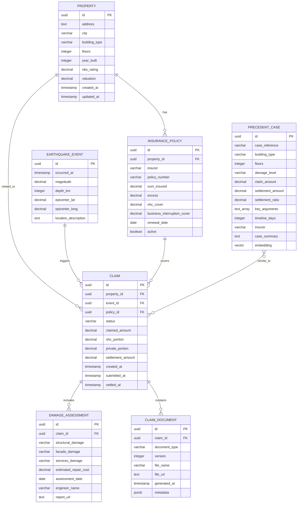

# SPARC Specification Document
## Earthquake Claim Accelerator MVP

### Version: 1.0.0
### Date: 2025-08-27
### Status: Draft

---

## Table of Contents

1. [System Overview and Objectives](#1-system-overview-and-objectives)
2. [Functional Specifications](#2-functional-specifications)
3. [Non-Functional Requirements](#3-non-functional-requirements)
4. [Data Models and Schemas](#4-data-models-and-schemas)
5. [API Specifications](#5-api-specifications)
6. [User Interface Specifications](#6-user-interface-specifications)
7. [Integration Points](#7-integration-points)
8. [Acceptance Criteria](#8-acceptance-criteria)

---

## 1. System Overview and Objectives

### 1.1 Purpose

The Earthquake Claim Accelerator MVP is an AI-powered system designed to streamline the processing of commercial property earthquake insurance claims in New Zealand. The system automates document analysis, provides precedent-based settlement insights, and generates comprehensive claim packages.

### 1.2 Scope

The MVP encompasses:
- Property and policy management
- Automated damage assessment from engineering reports
- AI-powered precedent case matching
- Document analysis and extraction
- Claim package generation
- Settlement strategy recommendations

### 1.3 Success Metrics

- **Primary**: Reduce claim processing time from 6 months to 2-3 months
- **Secondary**: Achieve 85%+ accuracy in damage assessment extraction
- **Tertiary**: Generate comprehensive claim packages in <5 minutes

### 1.4 System Boundaries

**In Scope:**
- Commercial property earthquake claims (Wellington CBD focus)
- PDF engineering report processing
- Image-based damage assessment
- Vector-based precedent matching
- Automated document generation

**Out of Scope:**
- Residential property claims
- Non-earthquake related claims
- Real-time seismic monitoring
- Direct insurer integrations (MVP phase)

---

## 2. Functional Specifications

### 2.1 Property Management System

#### 2.1.1 Property Registration

**Specification**: System shall allow registration of commercial properties with comprehensive building characteristics.

**Requirements**:
- **FR-2.1.1-1**: Support manual property entry with validation
- **FR-2.1.1-2**: Store building type (office, retail, mixed)
- **FR-2.1.1-3**: Record structural characteristics (floors, year built, NBS rating)
- **FR-2.1.1-4**: Maintain property valuations with timestamps
- **FR-2.1.1-5**: Generate unique property identifiers (UUID)

**Input Validation**:
- Address format: Must include street, Wellington
- Floors: 1-50 integer range
- Year built: 1800-2025 range
- NBS rating: 0-100% decimal
- Valuation: Positive decimal, max 12 digits

**Acceptance Criteria**:
```gherkin
Feature: Property Registration

Scenario: Valid commercial property registration
  Given I am on the property registration page
  When I enter valid property details:
    | Field        | Value                    |
    | Address      | 123 Lambton Quay        |
    | Building Type| office                   |
    | Floors       | 8                        |
    | Year Built   | 1995                     |
    | NBS Rating   | 67.5                     |
    | Valuation    | 25000000                 |
  And I submit the form
  Then the property should be created successfully
  And I should receive a property ID
  And the property should appear in the property list
```

#### 2.1.2 Property Search and Filtering

**Specification**: System shall provide efficient property search capabilities.

**Requirements**:
- **FR-2.1.2-1**: Search by address, building type, NBS rating range
- **FR-2.1.2-2**: Filter by valuation range and age brackets
- **FR-2.1.2-3**: Sort results by multiple criteria
- **FR-2.1.2-4**: Export filtered results to CSV

### 2.2 Insurance Policy Management

#### 2.2.1 Policy Registration

**Specification**: System shall manage insurance policy details and coverage calculations.

**Requirements**:
- **FR-2.2.1-1**: Link policies to properties (many-to-one relationship)
- **FR-2.2.1-2**: Store insurer details and policy numbers
- **FR-2.2.1-3**: Calculate coverage splits (NHC vs private)
- **FR-2.2.1-4**: Track policy status and renewal dates
- **FR-2.2.1-5**: Validate coverage amounts against property values

**Coverage Calculation Rules**:
- NHC cover: Fixed at $345,000 (inclusive of GST)
- Private cover: Property valuation minus NHC cover
- Business interruption: Separate coverage amount
- Excess amounts: Per policy terms

**Acceptance Criteria**:
```gherkin
Feature: Policy Coverage Calculation

Scenario: Standard policy registration
  Given a property valued at $15,000,000
  When I register a policy with sum insured $15,000,000
  Then the NHC portion should be $345,000
  And the private portion should be $14,655,000
  And the total coverage should equal the sum insured
```

### 2.3 Damage Assessment Module

#### 2.3.1 Engineering Report Processing

**Specification**: System shall extract structured damage data from PDF engineering reports using AI.

**Requirements**:
- **FR-2.3.1-1**: Accept PDF uploads (max 50MB)
- **FR-2.3.1-2**: Extract text using OCR and PDF parsing
- **FR-2.3.1-3**: Identify damage categories (structural, facade, services)
- **FR-2.3.1-4**: Extract cost estimates by category
- **FR-2.3.1-5**: Identify compliance issues and code requirements
- **FR-2.3.1-6**: Generate confidence scores for extractions

**Extraction Categories**:
```yaml
damage_categories:
  structural:
    - foundation_damage
    - column_damage
    - beam_damage
    - slab_damage
    - lateral_system_damage
  
  facade:
    - cladding_damage
    - glazing_damage
    - waterproofing_issues
    - architectural_features
  
  services:
    - hvac_systems
    - electrical_systems
    - plumbing_systems
    - fire_safety_systems
    - elevators_escalators

cost_categories:
  - demolition
  - structural_repair
  - facade_replacement
  - services_upgrade
  - temporary_works
  - professional_fees
```

**Acceptance Criteria**:
```gherkin
Feature: Engineering Report Analysis

Scenario: Successful PDF processing
  Given I have uploaded a valid engineering report
  When the system processes the document
  Then I should see extracted damage assessments
  And cost estimates should be categorized
  And the confidence score should be above 70%
  And compliance issues should be identified
```

#### 2.3.2 Photographic Damage Assessment

**Specification**: System shall analyze damage photographs to support claim documentation.

**Requirements**:
- **FR-2.3.2-1**: Accept image uploads (JPG, PNG, max 10MB each)
- **FR-2.3.2-2**: Classify damage types and severity
- **FR-2.3.2-3**: Identify damage locations (interior/exterior/structural)
- **FR-2.3.2-4**: Generate damage summaries from multiple images
- **FR-2.3.2-5**: Correlate photo evidence with report findings

### 2.4 Precedent Matching System

#### 2.4.1 Vector-Based Case Matching

**Specification**: System shall find similar historical cases using semantic similarity.

**Requirements**:
- **FR-2.4.1-1**: Generate embeddings for case descriptions
- **FR-2.4.1-2**: Perform vector similarity search using pgvector
- **FR-2.4.1-3**: Filter results by building characteristics
- **FR-2.4.1-4**: Re-rank based on multiple relevance factors
- **FR-2.4.1-5**: Return top-k similar cases with relevance scores

**Matching Criteria**:
```yaml
primary_filters:
  - building_type: exact_match
  - floors: range_match (+/- 2)
  - damage_level: categorical_similarity

ranking_factors:
  - vector_similarity: 50%
  - damage_alignment: 20%
  - claim_amount_proximity: 15%
  - insurer_match: 10%
  - recency: 5%
```

**Acceptance Criteria**:
```gherkin
Feature: Precedent Case Matching

Scenario: Finding similar office building claims
  Given I have a claim for an 8-floor office building
  With moderate structural damage
  And claimed amount of $8,000,000
  When I search for precedent cases
  Then I should receive 5 or fewer similar cases
  And all results should be office buildings
  And floors should be within 6-10 range
  And relevance scores should be above 60%
```

#### 2.4.2 Settlement Strategy Analysis

**Specification**: System shall analyze precedent patterns to recommend settlement strategies.

**Requirements**:
- **FR-2.4.2-1**: Calculate average settlement ratios by category
- **FR-2.4.2-2**: Identify common successful arguments
- **FR-2.4.2-3**: Analyze insurer-specific patterns
- **FR-2.4.2-4**: Estimate timeline based on complexity
- **FR-2.4.2-5**: Generate actionable strategy recommendations

### 2.5 Document Analysis Pipeline

#### 2.5.1 Document Processing Workflow

**Specification**: System shall process multiple document types in an automated pipeline.

**Requirements**:
- **FR-2.5.1-1**: Queue documents for async processing
- **FR-2.5.1-2**: Track processing status and progress
- **FR-2.5.1-3**: Handle processing failures with retry logic
- **FR-2.5.1-4**: Store processed results with versioning
- **FR-2.5.1-5**: Notify users of completion via WebSocket

**Processing States**:
```yaml
document_states:
  uploaded: "Document received and queued"
  processing: "AI analysis in progress"
  completed: "Processing successful"
  failed: "Processing failed with error"
  retry: "Retrying failed processing"
```

### 2.6 Claim Package Generation

#### 2.6.1 Automated Package Assembly

**Specification**: System shall generate comprehensive claim packages combining all evidence and analysis.

**Requirements**:
- **FR-2.6.1-1**: Compile property and policy information
- **FR-2.6.1-2**: Include extracted damage assessments
- **FR-2.6.1-3**: Add precedent case analysis
- **FR-2.6.1-4**: Generate settlement recommendations
- **FR-2.6.1-5**: Format as professional PDF document
- **FR-2.6.1-6**: Provide package download and sharing

**Package Structure**:
```yaml
claim_package_sections:
  executive_summary:
    - claim_overview
    - recommended_settlement
    - key_arguments
  
  property_details:
    - building_characteristics
    - policy_information
    - valuation_details
  
  damage_assessment:
    - engineering_report_summary
    - photographic_evidence
    - cost_breakdown
  
  precedent_analysis:
    - similar_cases
    - settlement_patterns
    - strategic_insights
  
  supporting_evidence:
    - compliance_issues
    - expert_opinions
    - additional_documentation
```

---

## 3. Non-Functional Requirements

### 3.1 Performance Requirements

#### 3.1.1 Response Time Requirements

- **NFR-3.1.1-1**: API responses < 200ms for 95% of requests
- **NFR-3.1.1-2**: Document processing initiation < 5 seconds
- **NFR-3.1.1-3**: Precedent search results < 3 seconds
- **NFR-3.1.1-4**: Claim package generation < 300 seconds

#### 3.1.2 Throughput Requirements

- **NFR-3.1.2-1**: Support 100 concurrent users
- **NFR-3.1.2-2**: Process 50 documents simultaneously
- **NFR-3.1.2-3**: Handle 1,000 API requests per minute

#### 3.1.3 Scalability Requirements

- **NFR-3.1.3-1**: Horizontal scaling capability
- **NFR-3.1.3-2**: Database read replicas for query performance
- **NFR-3.1.3-3**: Auto-scaling based on load metrics

### 3.2 Reliability Requirements

#### 3.2.1 Availability

- **NFR-3.2.1-1**: 99.5% uptime SLA
- **NFR-3.2.1-2**: Maximum 4 hours planned downtime per month
- **NFR-3.2.1-3**: Recovery time objective (RTO) < 1 hour

#### 3.2.2 Data Integrity

- **NFR-3.2.2-1**: ACID compliance for all transactions
- **NFR-3.2.2-2**: Automated daily backups with 30-day retention
- **NFR-3.2.2-3**: Point-in-time recovery capability

### 3.3 Security Requirements

#### 3.3.1 Authentication and Authorization

- **NFR-3.3.1-1**: Multi-factor authentication support
- **NFR-3.3.1-2**: Role-based access control (RBAC)
- **NFR-3.3.1-3**: Session management with timeout
- **NFR-3.3.1-4**: API key authentication for integrations

#### 3.3.2 Data Protection

- **NFR-3.3.2-1**: Encryption at rest (AES-256)
- **NFR-3.3.2-2**: Encryption in transit (TLS 1.3)
- **NFR-3.3.2-3**: PII data masking in logs
- **NFR-3.3.2-4**: Audit trail for all data access

### 3.4 Compliance Requirements

#### 3.4.1 Privacy Compliance

- **NFR-3.4.1-1**: Privacy Act 2020 compliance
- **NFR-3.4.1-2**: Data retention policies
- **NFR-3.4.1-3**: Right to deletion implementation

#### 3.4.2 Industry Standards

- **NFR-3.4.2-1**: ISO 27001 security controls
- **NFR-3.4.2-2**: SOC 2 Type II compliance readiness

---

## 4. Data Models and Schemas

### 4.1 Entity Relationship Diagram



### 4.2 Database Schema Definition

#### 4.2.1 Core Tables

```sql
-- Enable required extensions
CREATE EXTENSION IF NOT EXISTS "uuid-ossp";
CREATE EXTENSION IF NOT EXISTS "pgvector";

-- Properties table with full-text search
CREATE TABLE properties (
    id UUID PRIMARY KEY DEFAULT uuid_generate_v4(),
    address TEXT NOT NULL,
    city VARCHAR(50) DEFAULT 'Wellington',
    building_type VARCHAR(20) CHECK (building_type IN ('office', 'retail', 'mixed')),
    floors INTEGER CHECK (floors BETWEEN 1 AND 50),
    year_built INTEGER CHECK (year_built BETWEEN 1800 AND 2025),
    nbs_rating DECIMAL(5,2) CHECK (nbs_rating BETWEEN 0 AND 100),
    valuation DECIMAL(12,2) CHECK (valuation > 0),
    search_vector tsvector,
    created_at TIMESTAMP DEFAULT CURRENT_TIMESTAMP,
    updated_at TIMESTAMP DEFAULT CURRENT_TIMESTAMP
);

-- Auto-update search vector
CREATE OR REPLACE FUNCTION update_property_search_vector()
RETURNS TRIGGER AS $$
BEGIN
    NEW.search_vector := 
        setweight(to_tsvector('english', NEW.address), 'A') ||
        setweight(to_tsvector('english', COALESCE(NEW.building_type, '')), 'B');
    RETURN NEW;
END;
$$ LANGUAGE plpgsql;

CREATE TRIGGER property_search_vector_trigger
    BEFORE INSERT OR UPDATE ON properties
    FOR EACH ROW EXECUTE FUNCTION update_property_search_vector();

-- Insurance policies with coverage validation
CREATE TABLE insurance_policies (
    id UUID PRIMARY KEY DEFAULT uuid_generate_v4(),
    property_id UUID REFERENCES properties(id) ON DELETE CASCADE,
    insurer VARCHAR(50) NOT NULL,
    policy_number VARCHAR(100) NOT NULL,
    sum_insured DECIMAL(12,2) CHECK (sum_insured > 0),
    excess DECIMAL(10,2) DEFAULT 0,
    nhc_cover DECIMAL(10,2) DEFAULT 345000,
    business_interruption_cover DECIMAL(12,2) DEFAULT 0,
    renewal_date DATE,
    active BOOLEAN DEFAULT true,
    created_at TIMESTAMP DEFAULT CURRENT_TIMESTAMP,
    UNIQUE(policy_number, insurer)
);

-- Precedent cases with vector embeddings
CREATE TABLE precedent_cases (
    id UUID PRIMARY KEY DEFAULT uuid_generate_v4(),
    case_reference VARCHAR(50) UNIQUE NOT NULL,
    building_type VARCHAR(20) NOT NULL,
    floors INTEGER NOT NULL,
    damage_level VARCHAR(20) CHECK (damage_level IN ('none', 'minor', 'moderate', 'major', 'severe')),
    claim_amount DECIMAL(12,2) NOT NULL,
    settlement_amount DECIMAL(12,2) NOT NULL,
    settlement_ratio DECIMAL(5,4) GENERATED ALWAYS AS (settlement_amount / claim_amount) STORED,
    key_arguments TEXT[],
    timeline_days INTEGER,
    insurer VARCHAR(50),
    case_summary TEXT,
    embedding vector(1536),
    created_at TIMESTAMP DEFAULT CURRENT_TIMESTAMP,
    CHECK (settlement_amount <= claim_amount * 1.2)
);
```

#### 4.2.2 Indexes for Performance

```sql
-- Core indexes
CREATE INDEX idx_properties_building_type ON properties(building_type);
CREATE INDEX idx_properties_nbs ON properties(nbs_rating);
CREATE INDEX idx_properties_search ON properties USING gin(search_vector);
CREATE INDEX idx_policies_active ON insurance_policies(active) WHERE active = true;
CREATE INDEX idx_claims_status ON claims(status);
CREATE INDEX idx_claims_property ON claims(property_id);

-- Vector similarity index
CREATE INDEX idx_precedent_embedding ON precedent_cases 
    USING ivfflat (embedding vector_cosine_ops) 
    WITH (lists = 100);

-- Composite indexes for common queries
CREATE INDEX idx_precedent_search ON precedent_cases(building_type, floors, damage_level);
CREATE INDEX idx_claims_timeline ON claims(created_at, status);
```

### 4.3 Data Validation Rules

#### 4.3.1 Business Rules

```yaml
validation_rules:
  property:
    address: 
      - required: true
      - max_length: 255
      - pattern: "^.+,\\s*Wellington$"
    
    nbs_rating:
      - range: [0, 100]
      - decimal_places: 2
    
    valuation:
      - minimum: 100000
      - maximum: 100000000

  insurance_policy:
    sum_insured:
      - must_not_exceed_property_valuation: true
      - minimum_percentage_of_valuation: 80%
    
    nhc_cover:
      - fixed_amount: 345000
      - currency: NZD

  claim:
    nhc_portion:
      - maximum: 345000
      - calculation: "MIN(claimed_amount, 345000)"
    
    private_portion:
      - calculation: "MAX(0, claimed_amount - nhc_portion)"
    
    settlement_ratio:
      - range: [0.1, 1.2]
      - warning_if_above: 1.0
```

---

## 5. API Specifications

### 5.1 REST API Design

#### 5.1.1 API Base Configuration

```yaml
api_configuration:
  base_url: "https://api.earthquake-claims.co.nz/v1"
  content_type: "application/json"
  authentication: "Bearer Token"
  rate_limiting: "1000 requests/hour per user"
  
  standard_headers:
    - "X-Request-ID: UUID"
    - "X-API-Version: v1"
    - "Content-Type: application/json"
```

#### 5.1.2 Property Management Endpoints

```yaml
property_endpoints:
  create_property:
    method: POST
    path: "/properties"
    description: "Register a new commercial property"
    request_body:
      type: object
      required: [address, building_type, floors, valuation]
      properties:
        address: {type: string, maxLength: 255}
        building_type: {type: string, enum: [office, retail, mixed]}
        floors: {type: integer, minimum: 1, maximum: 50}
        year_built: {type: integer, minimum: 1800, maximum: 2025}
        nbs_rating: {type: number, minimum: 0, maximum: 100}
        valuation: {type: number, minimum: 100000}
    
    responses:
      201:
        description: "Property created successfully"
        body:
          property_id: {type: string, format: uuid}
          created_at: {type: string, format: date-time}
      400:
        description: "Invalid input data"
      409:
        description: "Property already exists"

  get_property:
    method: GET
    path: "/properties/{property_id}"
    parameters:
      - name: property_id
        in: path
        required: true
        type: string
        format: uuid
    
    responses:
      200:
        description: "Property details"
        body:
          id: {type: string, format: uuid}
          address: {type: string}
          building_type: {type: string}
          floors: {type: integer}
          year_built: {type: integer}
          nbs_rating: {type: number}
          valuation: {type: number}
          created_at: {type: string, format: date-time}
          updated_at: {type: string, format: date-time}

  search_properties:
    method: GET
    path: "/properties/search"
    parameters:
      - name: q
        description: "Search query"
        type: string
      - name: building_type
        type: string
        enum: [office, retail, mixed]
      - name: min_nbs
        type: number
      - name: max_nbs
        type: number
      - name: limit
        type: integer
        default: 20
      - name: offset
        type: integer
        default: 0
```

#### 5.1.3 Claim Management Endpoints

```yaml
claim_endpoints:
  create_claim:
    method: POST
    path: "/claims"
    request_body:
      type: object
      required: [property_id, event_date, initial_assessment]
      properties:
        property_id: {type: string, format: uuid}
        event_date: {type: string, format: date}
        initial_assessment:
          type: object
          properties:
            estimated_cost: {type: number}
            damage_description: {type: string}
    
    responses:
      201:
        body:
          claim_id: {type: string, format: uuid}
          status: {type: string, enum: [draft, processing, ready, submitted]}
          nhc_portion: {type: number}
          private_portion: {type: number}
          next_steps: {type: array, items: {type: string}}

  upload_document:
    method: POST
    path: "/claims/{claim_id}/documents"
    content_type: "multipart/form-data"
    parameters:
      - name: claim_id
        in: path
        required: true
        type: string
        format: uuid
      - name: file
        in: formData
        required: true
        type: file
        description: "PDF report or image file"
    
    responses:
      202:
        description: "Document uploaded and queued for processing"
        body:
          document_id: {type: string, format: uuid}
          status: {type: string, default: "processing"}
          estimated_completion: {type: string, format: date-time}

  get_precedents:
    method: GET
    path: "/claims/{claim_id}/precedents"
    parameters:
      - name: claim_id
        in: path
        required: true
        type: string
        format: uuid
      - name: limit
        type: integer
        default: 5
        maximum: 10
    
    responses:
      200:
        body:
          similar_claims:
            type: array
            items:
              type: object
              properties:
                case_reference: {type: string}
                building_type: {type: string}
                floors: {type: integer}
                claim_amount: {type: number}
                settlement_amount: {type: number}
                settlement_ratio: {type: number}
                timeline_days: {type: integer}
                relevance_score: {type: number}
                key_arguments: {type: array, items: {type: string}}
          
          insights:
            type: object
            properties:
              average_settlement_ratio: {type: number}
              average_timeline_days: {type: integer}
              success_factors: {type: array, items: {type: string}}
```

#### 5.1.4 Document Processing Endpoints

```yaml
document_endpoints:
  get_processing_status:
    method: GET
    path: "/documents/{document_id}/status"
    responses:
      200:
        body:
          document_id: {type: string, format: uuid}
          status: {type: string, enum: [queued, processing, completed, failed]}
          progress_percentage: {type: integer, minimum: 0, maximum: 100}
          extracted_data:
            type: object
            properties:
              confidence_score: {type: number}
              damage_categories: {type: object}
              cost_estimates: {type: object}
              compliance_issues: {type: array, items: {type: string}}

  generate_claim_package:
    method: POST
    path: "/claims/{claim_id}/package"
    responses:
      202:
        description: "Package generation initiated"
        body:
          generation_id: {type: string, format: uuid}
          estimated_completion: {type: string, format: date-time}
      
      200:
        description: "Package ready for download"
        body:
          package_url: {type: string, format: url}
          sections: {type: array, items: {type: string}}
          file_size: {type: integer}
          expires_at: {type: string, format: date-time}
```

### 5.2 WebSocket API for Real-time Updates

```yaml
websocket_events:
  connection:
    url: "wss://api.earthquake-claims.co.nz/ws"
    authentication: "JWT token in query parameter"
    
  document_processing_update:
    event: "document.processing.update"
    payload:
      document_id: {type: string}
      claim_id: {type: string}
      status: {type: string}
      progress: {type: integer}
      extracted_data: {type: object, nullable: true}
  
  claim_status_change:
    event: "claim.status.change"
    payload:
      claim_id: {type: string}
      old_status: {type: string}
      new_status: {type: string}
      timestamp: {type: string, format: date-time}
  
  package_generation_complete:
    event: "package.generation.complete"
    payload:
      claim_id: {type: string}
      package_url: {type: string}
      file_size: {type: integer}
```

### 5.3 Error Handling Standards

```yaml
error_responses:
  standard_format:
    type: object
    required: [error, message, timestamp]
    properties:
      error: {type: string, description: "Error code"}
      message: {type: string, description: "Human readable message"}
      details: {type: object, description: "Additional error context"}
      timestamp: {type: string, format: date-time}
      request_id: {type: string, format: uuid}
  
  common_errors:
    400:
      error: "VALIDATION_ERROR"
      message: "Request validation failed"
      details:
        field_errors: {type: array}
    
    401:
      error: "AUTHENTICATION_REQUIRED"
      message: "Valid authentication token required"
    
    403:
      error: "INSUFFICIENT_PERMISSIONS"
      message: "User lacks required permissions"
    
    404:
      error: "RESOURCE_NOT_FOUND"
      message: "Requested resource does not exist"
    
    429:
      error: "RATE_LIMIT_EXCEEDED"
      message: "Too many requests"
      details:
        retry_after: {type: integer}
    
    500:
      error: "INTERNAL_SERVER_ERROR"
      message: "An unexpected error occurred"
```

---

## 6. User Interface Specifications

### 6.1 Design Principles

#### 6.1.1 Usability Guidelines

- **Principle 1**: Minimize cognitive load - present information progressively
- **Principle 2**: Provide clear visual feedback for all actions
- **Principle 3**: Support both novice and expert workflows
- **Principle 4**: Maintain consistency across all interfaces

#### 6.1.2 Accessibility Requirements

- **WCAG 2.1 AA compliance** for all interactive elements
- **Keyboard navigation support** for all functions
- **Screen reader compatibility** with proper ARIA labels
- **Color contrast ratios** minimum 4.5:1 for normal text
- **Responsive design** supporting 320px to 2560px viewports

### 6.2 Page Specifications

#### 6.2.1 Dashboard Layout

```yaml
dashboard_specification:
  layout: "Two-column with sidebar"
  
  sidebar_navigation:
    - label: "Dashboard"
      icon: "home"
      route: "/dashboard"
    - label: "Properties"
      icon: "building"
      route: "/properties"
    - label: "Claims"
      icon: "file-text"
      route: "/claims"
    - label: "Precedents"
      icon: "search"
      route: "/precedents"
  
  main_content:
    header:
      title: "Claim Processing Dashboard"
      actions:
        - label: "New Claim"
          variant: "primary"
          action: "navigate_to_new_claim"
    
    widgets:
      - type: "statistics_cards"
        data:
          - title: "Active Claims"
            value: "{active_claims_count}"
            trend: "+12% from last month"
          - title: "Avg. Processing Time"
            value: "{avg_processing_days} days"
            trend: "-18% from last month"
          - title: "Settlement Rate"
            value: "{settlement_ratio}%"
            trend: "+5% from last month"
      
      - type: "recent_claims_table"
        columns: ["Property", "Status", "Amount", "Created"]
        actions: ["View", "Edit", "Generate Package"]
      
      - type: "processing_queue"
        shows: "Documents currently being processed"
        real_time_updates: true
```

#### 6.2.2 New Claim Wizard

```yaml
claim_wizard_specification:
  steps:
    step_1:
      title: "Property Selection"
      description: "Choose the property for this claim"
      components:
        - type: "property_search"
          features: ["text_search", "filter_by_type", "create_new"]
        - type: "property_preview"
          shows: ["address", "building_type", "valuation", "nbs_rating"]
      
      validation:
        - property_must_be_selected: true
        - property_must_have_active_policy: true
      
      next_condition: "valid_property_selected"
    
    step_2:
      title: "Event Information"
      components:
        - type: "date_picker"
          field: "event_date"
          validation: "must_be_within_last_5_years"
        - type: "text_area"
          field: "initial_description"
          placeholder: "Describe the initial damage assessment"
        - type: "number_input"
          field: "estimated_cost"
          format: "currency_nzd"
      
      calculations:
        - nhc_portion: "MIN(estimated_cost, 345000)"
        - private_portion: "MAX(0, estimated_cost - nhc_portion)"
    
    step_3:
      title: "Document Upload"
      components:
        - type: "file_dropzone"
          accept: [".pdf", ".jpg", ".png"]
          max_files: 20
          max_size: "50MB"
        - type: "upload_progress"
          shows_real_time_status: true
        - type: "document_list"
          shows: ["name", "type", "status", "actions"]
    
    step_4:
      title: "Review and Create"
      components:
        - type: "claim_summary"
          sections: ["property", "event", "financial", "documents"]
        - type: "next_steps_preview"
          shows: ["expected_timeline", "required_actions"]
```

#### 6.2.3 Claim Detail View

```yaml
claim_detail_specification:
  layout: "Tabbed interface with action sidebar"
  
  tabs:
    overview:
      sections:
        - type: "claim_header"
          shows: ["claim_id", "status", "created_date", "progress_bar"]
        - type: "financial_summary"
          shows: ["claimed_amount", "nhc_portion", "private_portion"]
        - type: "timeline"
          shows: ["key_events", "status_changes", "next_actions"]
    
    documents:
      components:
        - type: "document_grid"
          categories: ["reports", "photos", "correspondence"]
        - type: "extraction_results"
          shows: ["confidence_scores", "extracted_data", "edit_option"]
        - type: "upload_area"
          allows: "additional_documents"
    
    precedents:
      components:
        - type: "similar_cases_list"
          shows: ["relevance_score", "case_details", "settlement_info"]
        - type: "strategy_insights"
          shows: ["recommended_arguments", "timeline_estimate"]
        - type: "settlement_calculator"
          interactive: true
    
    package:
      components:
        - type: "package_preview"
          sections: ["executive_summary", "evidence", "recommendations"]
        - type: "generation_controls"
          actions: ["generate", "regenerate", "download"]
  
  sidebar_actions:
    primary:
      - label: "Generate Package"
        condition: "documents_processed"
        variant: "primary"
    
    secondary:
      - label: "Find Precedents"
        always_available: true
      - label: "Add Documents"
        always_available: true
      - label: "Export Data"
        always_available: true
```

### 6.3 Component Library Specifications

#### 6.3.1 Form Components

```yaml
form_components:
  property_selector:
    description: "Searchable dropdown with property creation option"
    props:
      - onSelect: function
      - allowCreate: boolean
      - filterBy: array
    
    features:
      - fuzzy_search: true
      - keyboard_navigation: true
      - create_new_inline: true
      - recent_selections: true
    
    accessibility:
      - aria_label: "Property selector"
      - role: "combobox"
      - keyboard_support: ["arrow_keys", "enter", "escape"]

  file_upload:
    description: "Drag-and-drop file upload with progress"
    props:
      - accept: string
      - multiple: boolean
      - maxSize: number
      - onUpload: function
    
    states:
      - idle: "Ready for files"
      - dragover: "Drop files here"
      - uploading: "Shows progress bars"
      - complete: "Shows success state"
      - error: "Shows error message"
    
    validation:
      - file_type_checking: true
      - size_validation: true
      - duplicate_prevention: true
```

#### 6.3.2 Data Display Components

```yaml
display_components:
  precedent_card:
    description: "Displays similar case information"
    props:
      - case_data: object
      - relevance_score: number
      - show_details: boolean
    
    sections:
      header:
        - case_reference: "Large, prominent text"
        - relevance_score: "Badge with percentage"
      
      content:
        - building_info: "Type, floors, year"
        - financial_info: "Claimed vs settled amounts"
        - timeline_info: "Days to settlement"
        - key_arguments: "Tags/badges"
    
    interactions:
      - expand_collapse: "Show/hide detailed information"
      - compare_mode: "Multi-select for comparison"
  
  damage_assessment_viewer:
    description: "Shows extracted damage data"
    props:
      - assessment_data: object
      - confidence_scores: object
      - editable: boolean
    
    layout:
      - confidence_indicator: "Color-coded score display"
      - category_tabs: ["Structural", "Facade", "Services"]
      - cost_breakdown: "Visual chart with editing"
      - compliance_issues: "Expandable list with severity"
```

### 6.4 Mobile Responsiveness

```yaml
responsive_design:
  breakpoints:
    mobile: "320px - 768px"
    tablet: "769px - 1024px"
    desktop: "1025px+"
  
  mobile_adaptations:
    navigation:
      - use: "bottom_tab_bar"
      - collapse: "sidebar_to_hamburger"
    
    forms:
      - single_column_layout: true
      - larger_touch_targets: "minimum 44px"
      - simplified_file_upload: "native_picker_option"
    
    tables:
      - convert_to: "card_layout"
      - show: "most_important_columns_only"
      - add: "expand_action_for_details"
    
    charts:
      - responsive_scaling: true
      - touch_interactions: true
      - simplified_legends: true
```

---

## 7. Integration Points

### 7.1 External System Integrations

#### 7.1.1 AI/ML Service Integrations

```yaml
ai_integrations:
  openai_gpt4:
    purpose: "Document text analysis and extraction"
    endpoints:
      - chat_completions: "For structured data extraction"
      - embeddings: "For precedent case similarity"
    
    configuration:
      model: "gpt-4-turbo"
      max_tokens: 8000
      temperature: 0.1
      timeout: 30_seconds
    
    data_handling:
      - no_training_data_use: true
      - data_retention: "zero_retention_policy"
      - privacy_compliance: "gdpr_compliant"

  azure_document_intelligence:
    purpose: "PDF parsing and OCR"
    endpoints:
      - analyze_document: "Extract text and structure"
      - analyze_layout: "Understand document organization"
    
    fallback_strategy:
      primary: "Azure Document Intelligence"
      secondary: "PyPDF2 + Tesseract OCR"
      
  custom_vision_model:
    purpose: "Damage assessment from photos"
    deployment: "Local inference server"
    model_type: "Fine-tuned ResNet for damage classification"
    
    classes:
      - no_damage
      - minor_crack
      - moderate_damage
      - severe_structural
      - water_damage
```

#### 7.1.2 Government Data Sources

```yaml
government_integrations:
  geonet_earthquake_api:
    purpose: "Real-time earthquake event data"
    endpoint: "https://api.geonet.org.nz/quake"
    
    data_sync:
      frequency: "daily"
      retention: "5_years"
      fields: ["magnitude", "depth", "location", "timestamp"]
    
    webhook_support:
      enabled: true
      event_types: ["magnitude_above_5.5"]

  linz_property_data:
    purpose: "Property boundary and characteristic data"
    api: "LINZ Data Service API"
    
    sync_strategy:
      - initial_bulk_import: "Wellington CBD properties"
      - incremental_updates: "monthly"
      - validation: "cross_reference_with_property_records"

  building_consent_authority:
    purpose: "Building consent and compliance data"
    integration_type: "Manual import (MVP)"
    future_automation: "Planned for v2.0"
```

#### 7.1.3 Insurance Industry APIs

```yaml
insurance_integrations:
  icnz_data_hub:
    purpose: "Industry claim benchmarking"
    access_level: "Member access required"
    data_types: ["settlement_trends", "processing_times"]
    
    compliance:
      - data_anonymization: "Required"
      - usage_restrictions: "Research and benchmarking only"

  insurer_specific_apis:
    vero:
      status: "Planned for v2.0"
      capabilities: ["claim_submission", "status_updates"]
    
    iag:
      status: "Under discussion"
      capabilities: ["policy_verification", "claim_lodgement"]
    
    tower:
      status: "Future consideration"
      capabilities: ["document_sharing", "case_management"]
```

### 7.2 Internal System Architecture

#### 7.2.1 Microservices Architecture

```yaml
service_architecture:
  api_gateway:
    responsibility: "Request routing, authentication, rate limiting"
    technology: "Kong API Gateway"
    features:
      - jwt_authentication: true
      - rate_limiting: "per_user_and_global"
      - request_logging: true
      - cors_handling: true

  claim_service:
    responsibility: "Core claim management logic"
    technology: "FastAPI (Python)"
    dependencies: ["database", "document_service", "precedent_service"]
    
    endpoints:
      - "/claims/*": "Claim CRUD operations"
      - "/claims/{id}/package": "Package generation"
      - "/claims/{id}/strategy": "Settlement strategy"

  document_service:
    responsibility: "Document processing and AI analysis"
    technology: "FastAPI with Celery workers"
    features:
      - async_processing: true
      - file_storage: "MinIO S3-compatible"
      - processing_queue: "Redis-backed"
    
    workers:
      pdf_processor: "Extract text and structure"
      image_analyzer: "Damage classification"
      ai_extractor: "Structured data extraction"

  precedent_service:
    responsibility: "Case matching and analysis"
    technology: "FastAPI with pgvector"
    features:
      - vector_similarity_search: true
      - caching: "Redis for frequent queries"
      - batch_updates: "Daily precedent database sync"

  notification_service:
    responsibility: "Real-time updates to frontend"
    technology: "WebSocket server (FastAPI)"
    features:
      - connection_management: true
      - event_broadcasting: true
      - authentication: "JWT validation"
```

#### 7.2.2 Data Flow Architecture

```yaml
data_flows:
  claim_creation_flow:
    steps:
      1: "Frontend → API Gateway → Claim Service"
      2: "Claim Service → Database (create claim record)"
      3: "Claim Service → Notification Service (status update)"
      4: "Frontend receives real-time update"
    
    error_handling:
      - database_failure: "Rollback and error response"
      - validation_failure: "Field-level error messages"

  document_processing_flow:
    steps:
      1: "Frontend uploads → API Gateway → Document Service"
      2: "Document Service → MinIO (file storage)"
      3: "Document Service → Redis Queue (processing job)"
      4: "Celery Worker picks up job"
      5: "Worker → AI Services (extraction)"
      6: "Worker → Database (save results)"
      7: "Worker → Notification Service (completion event)"
      8: "Frontend receives processing complete notification"
    
    monitoring:
      - queue_depth_alerts: "Alert if >100 jobs queued"
      - processing_time_tracking: "SLA monitoring"
      - failure_rate_monitoring: "Auto-retry failed jobs"

  precedent_matching_flow:
    steps:
      1: "Frontend request → Precedent Service"
      2: "Service checks cache (Redis)"
      3: "If cache miss → Database vector search"
      4: "Apply business logic filters"
      5: "Re-rank results by relevance"
      6: "Cache results → Return to frontend"
    
    optimization:
      - cache_ttl: "4 hours for search results"
      - precompute_embeddings: "Batch job nightly"
```

### 7.3 Security Integration Points

#### 7.3.1 Authentication and Authorization

```yaml
auth_integration:
  identity_provider:
    service: "Auth0 (or similar)"
    protocols: ["OAuth 2.0", "OpenID Connect"]
    
    user_attributes:
      - user_id: "Unique identifier"
      - email: "Primary contact"
      - role: "Permission level"
      - organization: "Company affiliation"

  role_based_access:
    roles:
      admin:
        permissions: ["all_claims", "user_management", "system_config"]
      
      claim_handler:
        permissions: ["create_claims", "view_own_claims", "generate_packages"]
      
      viewer:
        permissions: ["view_assigned_claims", "view_precedents"]
    
    implementation:
      - jwt_claims: "Include role in token"
      - api_middleware: "Validate permissions per endpoint"
      - frontend_guards: "Hide/show UI elements by role"

  audit_logging:
    events_to_log:
      - user_login: "Authentication events"
      - claim_access: "Who viewed which claims"
      - document_download: "File access tracking"
      - data_export: "Bulk data access"
    
    log_destination: "Centralized logging system (ELK Stack)"
    retention_period: "7 years for compliance"
```

#### 7.3.2 Data Protection Integration

```yaml
data_protection:
  encryption_at_rest:
    database: "PostgreSQL TDE (Transparent Data Encryption)"
    file_storage: "MinIO with SSE-S3 encryption"
    backups: "Encrypted backup files"

  encryption_in_transit:
    api_calls: "TLS 1.3 minimum"
    database_connections: "SSL required"
    internal_services: "mTLS for service-to-service"

  data_masking:
    production_data_in_dev:
      - property_addresses: "Anonymized to general area"
      - financial_amounts: "Scaled down by factor"
      - personal_information: "Completely masked"
    
    logging_and_monitoring:
      - no_sensitive_data_in_logs: true
      - api_request_sanitization: "Remove PII from logs"
```

---

## 8. Acceptance Criteria

### 8.1 Feature Acceptance Criteria

#### 8.1.1 Property Management

```gherkin
Feature: Property Registration and Management

Background:
  Given I am logged in as a claim handler
  And I am on the properties page

Scenario: Register a new office building
  When I click "Add New Property"
  And I fill in the property form:
    | Field         | Value                     |
    | Address       | 123 Lambton Quay         |
    | Building Type | Office                    |
    | Floors        | 12                        |
    | Year Built    | 1995                      |
    | NBS Rating    | 75.5                      |
    | Valuation     | 35000000                  |
  And I submit the form
  Then I should see "Property created successfully"
  And the property should appear in the property list
  And the property ID should be a valid UUID

Scenario: Search existing properties
  Given there are 50 properties in the system
  When I search for "Lambton Quay"
  Then I should see properties containing "Lambton Quay" in the address
  And results should be limited to 20 per page
  And I should see pagination controls

Scenario: Validate required fields
  When I try to create a property without an address
  Then I should see "Address is required"
  And the form should not submit
  And I should remain on the property creation page
```

#### 8.1.2 Document Processing

```gherkin
Feature: Engineering Report Processing

Background:
  Given I have a claim with ID "claim-123"
  And I am on the document upload page for this claim

Scenario: Upload and process PDF engineering report
  When I upload a valid PDF engineering report
  Then I should see "Document uploaded successfully"
  And the processing status should show "Processing"
  And I should receive a real-time notification when processing completes
  
  When processing is complete
  Then I should see extracted damage categories:
    | Category   | Status    |
    | Structural | Detected  |
    | Facade     | Detected  |
    | Services   | Minor     |
  And I should see cost estimates for each category
  And the confidence score should be above 70%

Scenario: Handle invalid file upload
  When I try to upload a file larger than 50MB
  Then I should see "File size exceeds limit"
  And the file should not be uploaded
  
  When I try to upload a .docx file
  Then I should see "Invalid file type. Please upload PDF, JPG, or PNG files."
  And the upload should be rejected

Scenario: Process multiple damage photos
  Given I upload 8 damage photos
  When all photos are processed
  Then I should see damage classifications for each photo
  And I should see a summary of detected damage types
  And photos with no detected damage should be clearly marked
```

#### 8.1.3 Precedent Matching

```gherkin
Feature: Precedent Case Matching

Background:
  Given there are 200 precedent cases in the system
  And I have a claim for an 8-floor office building
  With moderate structural damage
  And estimated repair cost of $5,000,000

Scenario: Find similar precedent cases
  When I click "Find Precedents"
  Then I should see up to 5 similar cases
  And all cases should be for office buildings
  And building floors should be within 6-10 range
  And each case should show a relevance score above 60%
  And results should be ordered by relevance score (highest first)

Scenario: View precedent case details
  When I click on a precedent case
  Then I should see:
    | Information        | Present |
    | Case reference     | Yes     |
    | Building details   | Yes     |
    | Damage assessment  | Yes     |
    | Claimed amount     | Yes     |
    | Settlement amount  | Yes     |
    | Settlement ratio   | Yes     |
    | Timeline          | Yes     |
    | Key arguments     | Yes     |

Scenario: Generate strategy insights
  Given I have found 5 precedent cases
  When I view the insights section
  Then I should see:
    - Average settlement ratio
    - Average timeline in days
    - Most common successful arguments
    - Insurer-specific patterns
  And insights should be based on all 5 cases
  And success factors should be ranked by frequency
```

#### 8.1.4 Claim Package Generation

```gherkin
Feature: Automated Claim Package Generation

Background:
  Given I have a complete claim with:
    - Property details
    - Processed engineering report
    - 5 damage photos analyzed
    - 3 precedent cases identified
  And I am on the claim detail page

Scenario: Generate comprehensive claim package
  When I click "Generate Claim Package"
  Then I should see "Package generation started"
  And the status should update to "Generating..." in real-time
  
  When generation is complete
  Then I should see "Package ready for download"
  And I should see a download link
  And the package should be a PDF file
  And the file should be downloadable for 7 days

Scenario: Verify package content structure
  Given I have generated a claim package
  When I download and open the package
  Then the package should contain these sections in order:
    1. Executive Summary
    2. Property Details
    3. Event Information  
    4. Damage Assessment
    5. Cost Analysis
    6. Precedent Case Analysis
    7. Settlement Strategy
    8. Supporting Documentation
  
  And each section should contain relevant data
  And all monetary amounts should be in NZD format
  And all dates should be in DD/MM/YYYY format

Scenario: Handle package generation failure
  Given the package generation service is unavailable
  When I try to generate a claim package
  Then I should see "Package generation failed. Please try again."
  And I should be able to retry the generation
  And the error should be logged for investigation
```

### 8.2 Performance Acceptance Criteria

#### 8.2.1 Response Time Requirements

```gherkin
Feature: System Performance Requirements

Scenario: API Response Times
  Given the system is under normal load (50 concurrent users)
  When I make API requests
  Then 95% of requests should respond within 200ms
  And 99% of requests should respond within 500ms
  And no request should take longer than 2 seconds

Scenario: Document Processing Performance
  Given I upload a 20MB engineering report
  When processing starts
  Then initial response should be received within 5 seconds
  And processing should complete within 60 seconds
  And progress updates should be sent every 10 seconds

Scenario: Precedent Search Performance
  Given a database with 1000 precedent cases
  When I search for similar cases
  Then results should be returned within 3 seconds
  And vector similarity calculation should complete within 1 second
```

#### 8.2.2 Scalability Requirements

```gherkin
Feature: System Scalability

Scenario: Concurrent User Load
  Given 100 users are using the system simultaneously
  When they perform various operations
  Then system response times should remain within acceptable limits
  And no user should experience timeouts
  And database connections should remain stable

Scenario: Document Processing Queue
  Given 50 documents are uploaded within 5 minutes
  When the processing queue handles the load
  Then all documents should be queued successfully
  And processing should start within 30 seconds
  And queue depth should not exceed 100 items
```

### 8.3 Security Acceptance Criteria

#### 8.3.1 Authentication and Authorization

```gherkin
Feature: Security Controls

Scenario: User Authentication
  Given I am not logged in
  When I try to access any protected page
  Then I should be redirected to the login page
  And I should see "Please log in to continue"

  When I provide valid credentials
  Then I should be logged in successfully
  And I should be redirected to my intended page
  And I should receive a valid JWT token

Scenario: Role-Based Access Control
  Given I am logged in as a "viewer" role user
  When I try to create a new claim
  Then I should see "Insufficient permissions"
  And the create claim button should not be visible
  
  But when I try to view existing claims
  Then I should see claims I have permission to access
  And I should not see claims outside my scope

Scenario: Session Security
  Given I am logged in
  When my session expires after 8 hours
  Then I should be automatically logged out
  And I should see "Session expired" message
  And I should need to log in again to continue
```

#### 8.3.2 Data Protection

```gherkin
Feature: Data Protection and Privacy

Scenario: Data Encryption
  Given the system stores sensitive claim data
  When data is saved to the database
  Then all sensitive fields should be encrypted at rest
  And database backups should be encrypted
  
  When data is transmitted
  Then all communication should use HTTPS/TLS 1.3
  And API responses should not leak sensitive data in error messages

Scenario: Audit Logging
  Given I perform various actions in the system
  When I view claims, download documents, or export data
  Then these actions should be logged
  And logs should include user ID, action, timestamp, and IP address
  And logs should be stored securely for 7 years
  And logs should not contain sensitive data in plain text
```

### 8.4 Integration Acceptance Criteria

#### 8.4.1 External Service Integration

```gherkin
Feature: External Service Integration

Scenario: AI Service Integration
  Given the OpenAI API is available
  When I process a document that requires AI analysis
  Then the system should successfully call the AI service
  And receive structured data in return
  And handle the response within 30 seconds
  And properly format the extracted data

Scenario: AI Service Fallback
  Given the primary AI service is unavailable
  When I try to process a document
  Then the system should attempt to use the fallback service
  And if that fails, show a clear error message
  And queue the document for retry when services are restored

Scenario: Database Integration
  Given the PostgreSQL database with vector extension
  When I perform vector similarity searches
  Then searches should complete within 3 seconds
  And results should be properly ranked by similarity
  And the system should handle concurrent searches
```

### 8.5 User Experience Acceptance Criteria

#### 8.5.1 Usability Requirements

```gherkin
Feature: User Experience and Usability

Scenario: Intuitive Workflow
  Given I am a new user with basic training
  When I follow the system workflow to create a claim
  Then I should be able to complete the process without additional help
  And each step should be clearly explained
  And I should always know what to do next

Scenario: Error Handling and Feedback
  Given I make an error in the system
  When an error occurs
  Then I should see a clear, helpful error message
  And I should know how to fix the problem
  And the system should not lose my work
  And I should be able to retry the action

Scenario: Mobile Responsiveness
  Given I am using a mobile device
  When I access the system
  Then all functionality should be available
  And the interface should be touch-friendly
  And text should be readable without zooming
  And forms should be easy to fill out
```

#### 8.5.2 Accessibility Requirements

```gherkin
Feature: Accessibility Compliance

Scenario: Keyboard Navigation
  Given I am using only keyboard navigation
  When I navigate through the system
  Then all interactive elements should be reachable
  And the tab order should be logical
  And I should see clear focus indicators
  And I should be able to complete all tasks

Scenario: Screen Reader Compatibility
  Given I am using a screen reader
  When I navigate the system
  Then all content should be properly announced
  And form labels should be associated with inputs
  And error messages should be announced
  And the page structure should be clear

Scenario: Color and Contrast
  Given I have visual impairments
  When I view the system
  Then all text should have sufficient contrast (4.5:1 minimum)
  And information should not rely solely on color
  And the system should be usable in high contrast mode
```

---

## Appendix A: Glossary

**AI Agent**: Automated software component that uses artificial intelligence to process documents and extract structured data.

**Claim Package**: Comprehensive document containing all evidence, analysis, and recommendations for an insurance claim.

**Embedding Vector**: Numerical representation of text content used for semantic similarity search.

**NBS Rating**: New Building Standard rating indicating earthquake resilience (0-100%).

**NHC Cover**: Natural Hazards Commission coverage, currently $345,000 including GST for commercial properties.

**Precedent Case**: Historical insurance claim used as reference for settlement patterns and strategies.

**Vector Similarity Search**: Database query technique using mathematical distance between embedding vectors to find similar content.

**Settlement Ratio**: Percentage of claimed amount that was actually paid out (settlement amount ÷ claimed amount).

---

## Appendix B: Technical Dependencies

```yaml
core_dependencies:
  backend:
    - python: ">=3.10"
    - fastapi: "^0.100.0"
    - sqlalchemy: "^2.0"
    - alembic: "^1.11"
    - celery: "^5.3"
    - redis: "^4.5"
    - psycopg2-binary: "^2.9"
    - pgvector: "^0.2"
    - openai: "^1.0"
    - pypdf2: "^3.0"
    - pillow: "^10.0"
    - numpy: "^1.24"
    - scikit-learn: "^1.3"

  frontend:
    - node: ">=18.0.0"
    - next: "^14.0"
    - react: "^18.0"
    - typescript: "^5.0"
    - tailwindcss: "^3.3"
    - "@tanstack/react-query": "^4.0"
    - "socket.io-client": "^4.7"

  infrastructure:
    - postgresql: ">=14"
    - redis: ">=6.0"
    - minio: "latest"
    - nginx: "latest"
    - docker: ">=20.0"
    - kubernetes: ">=1.25"
```

---

*This SPARC Specification Document serves as the foundational blueprint for the Earthquake Claim Accelerator MVP development. All implementation work should reference and adhere to the specifications outlined herein.*